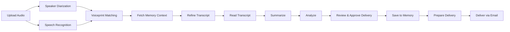

# 🎙️ Transcription Agent

**Turn your meeting recordings into searchable, summarized, actionable transcripts — powered by AI running on your own machine.**

Transcription Agent is a full-stack desktop application that automatically transcribes meeting audio, identifies who said what, extracts action items and decisions, and delivers summaries to your email, Google Drive, or Trello. Everything processes locally — your audio never leaves your computer unless you choose to send it through an integration.

---

## ✨ Features

| Feature                      | Description                                                                                                 |
| ---------------------------- | ----------------------------------------------------------------------------------------------------------- |
| **Automatic Transcription**  | Upload MP3, WAV, M4A, FLAC, OGG, or WebM audio — get a full speaker-labeled transcript                      |
| **Speaker Identification**   | Uses voiceprint matching to recognize and label known speakers across meetings                              |
| **Smart Summaries**          | Executive summary, key decisions, discussion points, and action items — no need to re-listen                |
| **Semantic Memory**          | ChromaDB-powered vector search across past meetings — find related discussions instantly                    |
| **Cross-Meeting Context**    | Ephemeral memory tracks recurring action items, budgets, decisions, and contacts                            |
| **Delivery Integrations**    | Send summaries via Gmail, save transcripts to Google Drive, create Trello cards                             |
| **Job History**              | Every transcription is saved — browse, search, and revisit past meetings anytime                            |
| **Visual Pipeline Progress** | Clear multi-stage stepper shows exactly what's happening at each step (up to 11 stages with approval gates) |
| **Manual Speaker Labeling**  | If speaker count doesn't match attendees, the pipeline pauses with playable audio clips for labeling        |
| **Self-Updating**            | Dev mode: git-based auto-updates. Packaged: electron-updater with GitHub Releases                           |

---

## 🖥️ How It Works



1. **Record your meeting** using Zoom, Teams, or any recording tool
2. **Upload the audio file** via drag-and-drop or file picker
3. **The ML pipeline processes the audio** — diarization detects who spoke when, ASR converts speech to text, voiceprints match known speakers
4. **The LLM pipeline refines, summarizes, and analyzes** — filler words removed, PII redacted, structured summary generated
5. **Review the results** — browse the transcript, read the summary, grab action items
6. **Deliver automatically** — send via email, save to Drive, or create Trello cards

---

## 🏗️ Architecture

The system runs as **four independent services**:

```
┌────────────────────────────────────────────────────────┐
│                   Electron Desktop App                  │
│  ┌──────────────────────────────────────────────────┐  │
│  │  React UI  ◄── IPC ──►  Main Process             │  │
│  │  (Vite)                 (spawns child processes)  │  │
│  └──────────────────────────────────────────────────┘  │
└──────────────────────┬─────────────────────────────────┘
                       │
         ┌─────────────┼─────────────┐
         ▼             ▼             ▼
   ┌──────────┐ ┌──────────┐ ┌──────────────────┐
   │  Bridge  │ │  Agent   │ │  Python Backend   │
   │  Server  │◄┤  Runner  │◄┤  (FastAPI :5001)  │
   │  :5010   │ │ (fs.watch)│ │                   │
   └────┬─────┘ └──────────┘ │  ┌─────────────┐  │
        │                    │  │  Whisper ASR │  │
        ▼                    │  ├─────────────┤  │
  ┌──────────────┐           │  │  Pyannote    │  │
  │  Gmail       │           │  │  Diarization │  │
  │  Drive       │           │  ├─────────────┤  │
  │  Trello      │           │  │  Voiceprint  │  │
  └──────────────┘           │  │  Matching    │  │
                             │  └─────────────┘  │
                             └──────────────────┘
```

| Service            | Port          | Tech               | Purpose                                                          |
| ------------------ | ------------- | ------------------ | ---------------------------------------------------------------- |
| **Python Backend** | `:5001`       | FastAPI + PyTorch  | ML pipeline: ASR, diarization, voiceprints, memory               |
| **Bridge Server**  | `:5010`       | Node.js HTTP       | REST proxy, sanitization, agent config management                |
| **Agent Runner**   | —             | Node.js (fs.watch) | LLM pipeline: reads queue, calls DeepSeek/Ollama, executes tools |
| **Electron App**   | `:5173` (dev) | React + Vite       | Desktop UI: upload, progress, results, config                    |

### Memory Systems

- **Semantic Memory** — ChromaDB vector search over past meeting transcripts and summaries
- **Ephemeral Memory** — SQLite store for cross-meeting context (action items, contacts, budgets, decisions)
- **Voiceprints** — SQLite database of speaker embedding vectors for automatic identification

### Supported Platforms

| Platform            | Whisper Variant | Accelerator         |
| ------------------- | --------------- | ------------------- |
| macOS Apple Silicon | mlx-whisper     | Apple Neural Engine |
| macOS Intel         | faster-whisper  | CPU (CTranslate2)   |
| Windows             | faster-whisper  | CPU / CUDA          |
| Linux               | faster-whisper  | CPU / CUDA          |

### LLM Providers

- **DeepSeek** (default) — cloud API, DeepSeek V4
- **Ollama** — local LLM, supports qwen3.6 and deepseekv2

---

## 🚀 Quick Start

### Prerequisites

- **Python 3.10+**
- **Node.js 20 LTS**
- **FFmpeg** (auto-installed if missing)
- **Hugging Face token** (free) — required for the speaker diarization model

### Installation

```bash
# Clone the repository
git clone <repo-url>
cd ai_transcription_agent

# Full setup (venv, pip, npm, platform Whisper)
npm run transcribe:setup

# Configure your API keys
# Edit .env or use the app's ConfigPanel:
#   DEEPSEEK_API_KEY=sk-your-key
#   HUGGING_FACE_TOKEN=hf-your-token

# Start all backend services
npm run transcribe:all

# In another terminal, start the UI
npm run electron:dev
```

### First Run

1. The app opens with the **Upload Panel** ready
2. Click the gear icon ⚙️ in the status bar to open **ConfigPanel**
3. Enter your **DeepSeek API Key** (or configure Ollama as the LLM provider)
4. Enter your **Hugging Face Token** (required for speaker diarization)
5. Drag an audio file onto the upload area or click to browse
6. Watch the pipeline progress and review your results!

---

## 📚 Documentation

| Document                                                                     | Description                                                                        |
| ---------------------------------------------------------------------------- | ---------------------------------------------------------------------------------- |
| [System Overview](docs/system_overview.md)                                   | High-level architecture, data flow, and design decisions                           |
| [Backend Architecture](docs/backend_architecture.md)                         | Python backend modules, ML pipeline, memory systems                                |
| [Electron Architecture](docs/electron_architecture.md)                       | Main process, renderer, IPC, component tree                                        |
| [Development Setup](docs/dev_setup_installation.md)                          | Step-by-step dev setup, build instructions, troubleshooting                        |
| [API Endpoints](docs/api_endpoints.md)                                       | Full API reference for Python backend and bridge server                            |
| [Testing Checklist](docs/testing_checklist.md)                               | Manual and automated test cases for all features                                   |
| [Windows Install/Uninstall/Update](docs/windows_install_uninstall_update.md) | Installer behavior, update mechanism, uninstall process                            |
| [End User Guide](docs/end_user_guide.md)                                     | Non-technical guide for using the app — upload, pipeline, results, troubleshooting |

---

## 🛠️ Development Scripts

| Script                        | Description                  |
| ----------------------------- | ---------------------------- |
| `npm run transcribe:setup`    | Full first-time setup        |
| `npm run transcribe:all`      | Start all backend services   |
| `npm run transcribe:backend`  | Start Python backend only    |
| `npm run transcribe:bridge`   | Start bridge server only     |
| `npm run transcribe:runner`   | Start agent runner only      |
| `npm run electron:dev`        | Start Electron in dev mode   |
| `npm run electron:build`      | TypeScript + Vite build      |
| `npm run electron:dist:win`   | Build Windows NSIS installer |
| `npm run electron:dist:mac`   | Build macOS DMG              |
| `npm run electron:dist:linux` | Build Linux AppImage         |

---

## 🤝 Integrations

| Service          | What It Does                                      | Setup Required         |
| ---------------- | ------------------------------------------------- | ---------------------- |
| **Gmail**        | Sends meeting summaries and transcripts via email | Gmail API credentials  |
| **Google Drive** | Saves transcripts and summaries to a Drive folder | Drive API credentials  |
| **Trello**       | Creates action items as Trello cards              | Trello API key + token |

---

## 📋 Pipeline Steps (Configurable)

The agent pipeline is fully configurable via the **Agent Instructions** tab in ConfigPanel:

1. **Fetch Memory Context** — retrieve past action items, decisions, and budgets
2. **Refine Transcript** — redact PII from transcript
3. **Read Transcript** — retrieve the refined speaker-labeled transcript
4. **Summarize** — generate executive summary, key decisions, action items
5. **Analyze** — extract topics, sentiment, entities, follow-ups
6. **Review & Approve Delivery** — pause for user to review transcript, summary, and analysis before saving
7. **Save to Memory** — persist to semantic and ephemeral memory
8. **Prepare Delivery** — package results for delivery destinations
9. **Deliver via Email** — send meeting summary and analysis to recipients
10. **Save to Drive** — save meeting summary to Google Drive (disabled by default)
11. **Create Trello Cards** — create action items in Trello (disabled by default)

Steps can be reordered, enabled/disabled, and customized without touching code.

---

## ⚙️ Configuration Workflow

### Where Config Lives

| Location                                             | Platform | Contents                              |
| ---------------------------------------------------- | -------- | ------------------------------------- |
| `~/Library/Application Support/Transcription Agent/` | macOS    | All user data — config, storage, logs |
| `%APPDATA%\Transcription Agent\`                     | Windows  | All user data — config, storage, logs |

Within that directory:

| Path                            | Purpose                                               |
| ------------------------------- | ----------------------------------------------------- |
| `config.json`                   | UI-saved settings (API keys, preferences)             |
| `config.defaults.json`          | Snapshot of shipped defaults (one-click restore)      |
| `agent-config/pipeline.json`    | Pipeline step definitions (reorder, enable/disable)   |
| `agent-config/tools.json`       | Tool schemas the LLM can invoke                       |
| `agent-config/system-prompt.md` | LLM system prompt template                            |
| `agent-config/.defaults/`       | Shipped defaults for agent config (one-click restore) |

### Git Safety

The following files are **gitignored** — they exist in your local checkout but are never committed:

- `agent-config/pipeline.json`, `tools.json`, `system-prompt.md`
- `agent-config/.defaults/`, `.restart-flag`
- `.env`

**Template copies** are committed to the repo as reference:

- `agent-config/pipeline.template.json`
- `agent-config/tools.template.json`
- `agent-config/system-prompt.template.md`

When you clone the repo, the app auto-copies these templates to `userData/agent-config/` on first run.

**Never commit your `.env`, `config.json`, or agent-config live files to version control.**

### Export / Import Between Machines

1. Open **Settings** → **Config** tab
2. Click **Export Configuration** — saves a single `.json` file
3. Transfer the file to another machine (USB, cloud, etc.)
4. On the new machine, open **Settings** → **Config** tab
5. Click **Import Configuration** — all settings and agent configs are restored

Export captures:

- User settings (API keys, preferences)
- Agent instructions (system prompt, pipeline steps, tools)
- User defaults snapshot
- Agent defaults snapshot

After uninstall/reinstall (which wipes `userData`), import restores everything and the app runs immediately.

### After `git pull`

Your local configuration in `userData/agent-config/` is **untouched** by `git pull`. The repo template files may update with new defaults, but your live config stays as-is.

---

## 🔒 Privacy

- All audio processing (diarization + ASR) runs **locally** on your machine
- LLM calls go to **DeepSeek API** (or your local **Ollama** instance)
- Your audio files and transcripts **never leave your computer** unless you enable delivery integrations
- Sensitive data is **redacted** by the refine step (emails, phone numbers, SSNs, etc.)
- Delivery destinations are opt-in per job

---

## 📄 License

Built with ❤️ for people who have too many meetings and not enough time.
