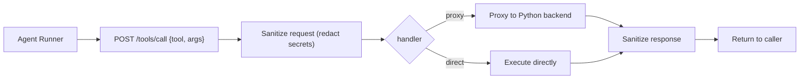

# API Endpoints

The system exposes two HTTP APIs — a Python backend and a local bridge server.
The bridge proxies most calls to the Python backend and is the entry point the
agent runner uses for tool execution.

> ⚠️ **Internal API — not documented here.** The full endpoint catalog (routes,
> request/response shapes, queue internals, storage paths) is deliberately **not
> published** in this public repo. The endpoints are an internal implementation
> detail and change frequently; documenting them publicly would expose
> unauthenticated attack surface and stale/inaccurate information.

## What exists at a high level

- **Python backend** — transcription pipeline (upload, status, transcript,
  summary, analysis, speaker labeling, delivery), memory (ephemeral + semantic
  vector store), attendee/voiceprint registration, and the SQLite-backed event
  queue.
- **Bridge server** — a single `POST /tools/call` endpoint used by the agent
  runner for all tool execution. It sanitizes requests/responses (redacts
  secrets) and proxies to the Python backend.
- **Agent config endpoints** — get/save/restore the agent pipeline configuration
  and restart the agent runner.

**Source:** [`bridge-server/index.js`](../bridge-server/index.js#L1)

## For developers

If you are working on the app itself, the full endpoint catalog is maintained in
the internal docs (served in-app via **Dev → Guide**), alongside the backend
architecture. All endpoints are bound to `localhost` for local development and
are not intended to be called by external clients.

