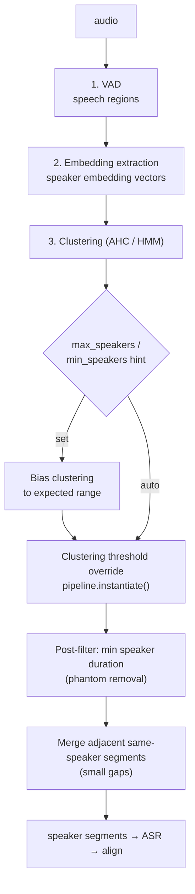

# ASV Speaker Detection Tuning

Techniques to reduce phantom speakers in pyannote/speaker-diarization-3.1 diarization.

---

## Background

Speaker diarization (ASV — Automatic Speaker Verification / Segmentation) identifies "who spoke when" in an audio file. The system uses **pyannote/speaker-diarization-3.1**, which works in three stages:

1. **VAD** (Voice Activity Detection) — finds speech regions in the audio.
2. **Embedding extraction** — converts each segment to a speaker embedding vector.
3. **Clustering** (AHC / Bayesian HMM) — groups segments by embedding similarity.

**Phantom speakers** occur when noise, reverberation, or non-speech events (door clicks, paper rustling, microphone bumps, coughs, laughter) produce embedding clusters that are distinct enough from real speakers. Even a 50ms cough can spawn an entire phantom speaker.



**Source:** [`run_diarization()`](../python-backend/transcription.py#L490) · [`_run_diarization_subprocess()`](../python-backend/transcription.py#L264) · [`DIARIZATION_MODEL`](../python-backend/config.py#L81)

---

## Configuration Reference

| Setting | Default | File |
|---------|---------|------|
| Diarization model | `pyannote/speaker-diarization-3.1` | `python-backend/config.py` |
| `DEVICE` | `auto` (detects MPS/CPU) | `python-backend/config.py` |
| Clustering threshold | Model default | pyannote pipeline |
| Min speaker duration | None (no filtering) | `python-backend/transcription.py` |

---

## Techniques (Sorted by Impact / Complexity)

### 1. Post-Process: Filter by Minimum Speaker Duration **← Highest ROI**

**What:** After diarization, discard speaker clusters that have very little total speech or very few segments. Phantoms typically have short, scattered segments.

**Where:** `python-backend/transcription.py`, in `run_diarization()`, after segment collection.

```python
# Filter out likely phantom speakers: < 3s total duration or < 3 segments
MIN_SPEAKER_DURATION = 3.0   # seconds of total speech
MIN_SPEAKER_SEGMENTS = 3     # minimum number of segments

filtered_segments = []
for spk, dur in speaker_duration.items():
    spk_segs = [s for s in segments if s["speaker"] == spk]
    if dur >= MIN_SPEAKER_DURATION and len(spk_segs) >= MIN_SPEAKER_SEGMENTS:
        filtered_segments.extend(spk_segs)

# Reassign dropped phantom segments to the nearest real speaker
# by time-overlap, or simply discard them.
segments = filtered_segments
```

**Pros:** Simple, no model changes, zero extra inference cost.  
**Cons:** Could discard a real speaker with very little airtime (rare in meetings).

### 2. Merge Adjacent Same-Speaker Segments with Small Gaps

**What:** pyannote sometimes fragments a single speaker's utterance across multiple clusters when there's a breath pause or brief noise. Merging same-speaker segments that are < 0.5s apart smooths this out.

**Where:** `python-backend/transcription.py`, as a post-processing step.

```python
MERGING_GAP = 0.5  # seconds

merged = []
for seg in sorted(segments, key=lambda s: s["start"]):
    if merged and merged[-1]["speaker"] == seg["speaker"] and seg["start"] - merged[-1]["end"] <= MERGING_GAP:
        merged[-1]["end"] = max(merged[-1]["end"], seg["end"])
        merged[-1]["duration"] = merged[-1]["end"] - merged[-1]["start"]
    else:
        merged.append(dict(seg))
segments = merged
```

**Pros:** Reduces segment count, improves clustering stability.  
**Cons:** Minor; doesn't eliminate phantoms on its own.

### 3. Pass `min_speakers` / `max_speakers` Hints to pyannote

**What:** The pyannote Pipeline accepts `min_speakers` and `max_speakers` at inference time, biasing the clustering toward an expected range.

**Where:** `python-backend/transcription.py`, in the `self._diarization(audio_path)` call.

```python
# Use upload attendee count as an upper bound + 1 margin
attendee_count = len(metadata.get("attendees", [])) if metadata else 0
max_spk = max(2, attendee_count + 1) if attendee_count > 0 else None

kwargs = {}
if max_spk:
    kwargs["max_speakers"] = max_spk
    kwargs["min_speakers"] = 2  # at least 2 for conversation

diarization = self._diarization(audio_path, **kwargs)
```

**Note:** `metadata` is not currently accessible inside `run_diarization()`. You'd need to pass it from the caller in `_run_pipeline_sync` / `_run_pipeline_resumed_sync` in `main.py`.

**Pros:** Directly constrains the clustering.  
**Cons:** If `max_speakers` is too tight, real speakers could be merged. Requires plumbing metadata into the function.

### 4. Adjust Clustering Threshold

**What:** Override pyannote's built-in clustering threshold. A higher threshold = more conservative clustering (fewer speakers). A lower threshold = more aggressive (more speakers).

**Where:** `python-backend/transcription.py`, in the model loading section.

```python
pipeline = Pipeline.from_pretrained(...)
pipeline.instantiate({"clustering_threshold": 0.65})
```

The default threshold varies by model version. Experiment with values between 0.55 (more clusters) and 0.75 (fewer clusters).

**Pros:** No runtime overhead.  
**Cons:** Requires experimentation; a single threshold may not suit all audio.

### 5. Independent VAD Pre-Filtering

**What:** Run a separate VAD (e.g., Silero VAD) on the raw audio *before* diarization. Strip out segments shorter than ~0.3s. This cleans the input so pyannote clusters fewer noise artifacts.

**Where:** New step in `run_diarization()` before calling the pyannote pipeline.

```python
import silero_vad

vad = silero_vad.load_vad_model()
speech_timestamps = vad.get_speech_timestamps(audio_path, min_speech_duration_ms=300)
# Pass cleaned audio or filtered timestamps to pyannote
```

**Pros:** Directly reduces noise clusters.  
**Cons:** Adds a dependency (`silero-vad`). Small inference cost (~50ms on GPU).

### 6. Temperature Scaling on Embedding Similarity

**What:** Apply a small temperature factor to the cosine similarity matrix in voiceprint matching (`voiceprint.py`) to desensitize it to low-confidence matches. This doesn't affect pyannote directly but improves the downstream speaker-name matching.

**Where:** `python-backend/voiceprint.py`, in `find_matching_voiceprints()`.

```python
SIMILARITY_TEMPERATURE = 1.5  # > 1 desensitizes, < 1 sensitizes
adjusted_similarity = np.exp(cos_sim / SIMILARITY_TEMPERATURE)
```

**Pros:** Tunes the voiceprint matching side.  
**Cons:** Indirect effect on phantom detection.

### 7. Cross-Modal Validation with ASR (Most Robust)

**What:** After ASR runs on the diarized segments, discard any speaker cluster whose segments produce empty or near-empty ASR output. A phantom cluster over a noise spike will have no transcribed text.

**Where:** `python-backend/transcription.py`, in `align_transcript()` or as a post-step in `main.py`'s pipeline.

```python
# After alignment: discard diarized speakers with < 5 chars of ASR output
MIN_TRANSCRIPT_CHARS = 5
valid_speakers = set()
for seg in aligned:
    if len(seg.get("text", "").strip()) >= MIN_TRANSCRIPT_CHARS:
        valid_speakers.add(seg["speaker"])

aligned = [seg for seg in aligned if seg["speaker"] in valid_speakers]
```

**Pros:** Highly reliable — if there's no text, there's no speaker.  
**Cons:** Runs after ASR, so the phantom has already consumed inference time. May discard a real speaker who only utters brief backchannels ("mm-hmm", "okay").

---

## Current Implementation Status

As of 2026-07-26, the following have been implemented:

| Technique | Status | Config Panel Control | Default |
|-----------|--------|---------------------|---------|
| #1 Min speaker duration filter | ✅ Implemented | `Min Speaker Duration (s)` | `3.0` |
| #2 Merge adjacent segments | ✅ Implemented | `Merging Gap (s)` | `0.5` |
| #3 `max_speakers` hint | ✅ Implemented | `Max Speakers (0 = auto)` | `0` |
| #4 Clustering threshold | ✅ Implemented | `Clustering Threshold (0 = default)` | `0.0` |
| #5 Independent VAD pre-filtering | ❌ Not implemented | — | — |
| #6 Temperature scaling | ❌ Not implemented | — | — |
| #7 Cross-modal validation with ASR | ❌ Not implemented | — | — |

**Where to configure:** Open the Config Panel → **Diarization** section tab (appears alongside LLM Provider, Pipeline, etc.).

**Expected Improvement** (with default settings):

- **Without filtering:** 2-speaker meeting → 3–5 diarized speakers (1–3 phantoms).
- **With #1 + #2 (defaults):** 2-speaker meeting → 2–3 diarized speakers (0–1 phantoms).
- **With #1 + #2 + #3 (attendee-based):** 2-speaker meeting → 2 diarized speakers (phantoms eliminated).

---

## Testing

After changing the diarization or post-processing, run a quick validation:

```bash
# Upload a test recording through the app's New Job form (or an internal test
# script), then inspect the pipeline log for the diarization summary.
```

Then check the pipeline logs for the diarization summary line:

```
✅ [transcription] Diarization complete — 47 segments, 2 speakers, 342.1s total speech
```

And for post-processing feedback:

```
🧹 Filtered 1 phantom speaker(s): SPEAKER_02 — below 3.0s or 3 segments
🧹 Merged 3 adjacent same-speaker segments (gap ≤ 0.5s)
📊 Post-processing: 3 → 2 speaker(s), 50 → 47 segments
```

If it still shows 3+ speakers, adjust the thresholds in **Config Panel → Diarization** or override via environment variables.
