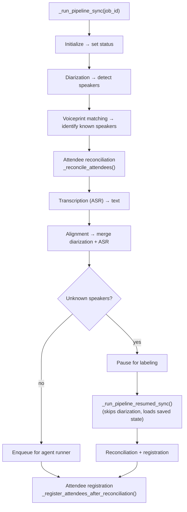
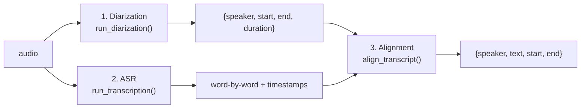

# Backend Architecture

The transcription backend is a FastAPI application running on port `:5001`. It handles audio processing, ML inference, and persistent storage.

---

## Directory Structure

```
python-backend/
├── main.py              # FastAPI app — env setup, app/CORS, include_router, __main__ (~120 lines)
├── config.py            # Configuration from environment variables
├── models.py            # Pydantic request/response models
├── transcription.py     # TranscriptionEngine — ASR + diarization + alignment
├── upload.py            # AudioUploader — file validation, standardization, status management
├── voiceprint.py        # VoiceprintManager — speaker embedding extraction, matching, DB
├── agent_bridge.py      # AgentBridge — writes to SQLite event queue, triggers agent runner
├── semantic_memory.py   # SemanticMemory — ChromaDB vector storage for meeting search
├── ephemeral_memory.py  # EphemeralMemory — SQLite store for cross-meeting context
├── constants.py         # Status sets, ephemeral-table defs, pipeline tuning constants (Phase 0)
├── helpers.py           # Misc pure helpers (Phase 0)
├── refinement.py        # _auto_refine / PII redaction (Phase 0)
├── reconciliation.py    # Attendee reconciliation + registration helpers (Phase 0)
├── pipeline_state.py    # PipelineState — shared `state` singleton (Phase 1)
├── model_preload.py     # Model preload machinery + /transcribe/models/status (Phase 1)
├── routes/              # Route modules (Phase 3): transcription, labeling, gates, agent,
│                        #   memory, queue, jobs, storage, system (one APIRouter per domain)
├── services/            # Singleton registry (__init__.py) + pipeline.py (Phase 2) +
│                        #   lifespan.py (Phase 4)
├── utils.py             # Shared utilities (network error detection)
├── patches.py           # Monkey-patches for third-party library compatibility
└── requirements.txt     # Python dependencies
```

---

## Module Details

### `main.py` — FastAPI Application

> **Refactor status:** `main.py` has been split into domain modules per
> [`docs/main-py-refactor-plan.md`](main-py-refactor-plan.md). **Phases 0–4 are done** — `main.py` is now
> ~120 lines (env setup + FastAPI app/CORS + `include_router(...)` + `__main__`). Extracted modules:
> `constants.py`, `refinement.py`, `helpers.py`, `reconciliation.py`, `pipeline_state.py` (the shared `state`
> singleton), `model_preload.py`, the `services/` package (`__init__.py` registry + `pipeline.py` ML
> orchestration + `lifespan.py` startup/shutdown), and the `routes/` package (one `APIRouter` per domain,
> incl. `system.py` for `/health`). The pipeline/reconciliation symbols described in this section are the
> logical structure; they live in the extracted modules (reading singletons via `services.*` and pipeline
> state via `state.*`).

**Lifecycle:** Uses FastAPI's `lifespan` context manager for startup/shutdown, defined in
`services/lifespan.py` (Phase 4).

On **startup:**

- Initializes all managers: `AudioUploader`, `VoiceprintManager`, `AgentBridge`, `SemanticMemory`, `EphemeralMemory`
- Creates storage directories
- Cleans up orphaned jobs (jobs that were mid-pipeline when the process was killed are marked as `failed`)

**Pipeline orchestration:**

- `_run_pipeline_async(job_id)` — wraps the ML pipeline in an asyncio task with semaphore limiting
- `_run_pipeline_sync(job_id)` — synchronous pipeline runner:
  1. Initialize → set status
  2. Diarization → detect speakers
  3. Voiceprint matching → identify known speakers
  4. **Attendee reconciliation** — `_reconcile_attendees()` cross-references registered attendees against matched/unknown speakers to determine who spoke and who didn't
  5. Transcription (ASR) → convert speech to text
  6. Alignment → merge diarization + ASR
  7. Enqueue for agent runner (or pause for labeling if unknown speakers remain)
  8. **Attendee registration** — `_register_attendees_after_reconciliation()` persists the reconciled attendee list to the ephemeral DB (only after full reconciliation)
- `_run_pipeline_resumed_sync(job_id)` — resuming after speaker labeling (skips diarization, loads saved state, includes same reconciliation + registration steps)



**Source:** [`_run_pipeline_sync()`](../python-backend/services/pipeline.py#L237) · [`_run_pipeline_resumed_sync()`](../python-backend/services/pipeline.py#L813) · [`_reconcile_attendees()`](../python-backend/reconciliation.py#L19) · [`_register_attendees_after_reconciliation()`](../python-backend/reconciliation.py#L357)

**Concurrency:** Limited by `MAX_CONCURRENT_PIPELINES` (default: 2) via asyncio.Semaphore. The status check endpoint is excluded from the concurrency limit.

### `config.py` — Configuration

All settings come from environment variables, with sensible defaults:

| Variable                   | Default                            | Description                                       |
| -------------------------- | ---------------------------------- | ------------------------------------------------- |
| `TRANSCRIPTION_HOST`       | `127.0.0.1`                        | Bind address                                      |
| `TRANSCRIPTION_PORT`       | `5001`                             | HTTP port                                         |
| `TRANSCRIPTION_STORAGE`    | `<root>/storage`                   | Job data directory                                |
| `TRANSCRIPTION_QUEUE_DIR`  | `<root>/queue`                     | Trigger file directory (`.transcription-trigger`) |
| `WHISPER_MODEL_SIZE`       | `medium`                           | ASR model size                                    |
| `DIARIZATION_MODEL`        | `pyannote/speaker-diarization-3.1` | Diarization pipeline                              |
| `EMBEDDING_MODEL`          | `pyannote/embedding`               | Voiceprint embedding model                        |
| `VOICEPRINT_THRESHOLD`     | `0.75`                             | Cosine similarity threshold                       |
| `HUGGING_FACE_TOKEN`       | `None`                             | Auth for gated models                             |
| `MAX_CONCURRENT_PIPELINES` | `2`                                | Parallel job limit                                |

### `transcription.py` — ML Engine

**Three-stage pipeline:**

1. **Diarization** — `run_diarization(audio_path)`:
   - Uses pyannote/speaker-diarization-3.1 Pipeline
   - Output: list of `{speaker, start, end, duration}` segments
   - Speaker labels are cluster IDs (SPEAKER_00, SPEAKER_01...)

2. **ASR** — `run_transcription(audio_path)`:
   - Platform-optimized Whisper backend:
     - macOS (Apple Silicon) → `mlx-whisper` (Apple Neural Engine, ~4x real-time) - macOS (Intel) → `faster-whisper` (CTranslate2, CPU) - Windows/Linux → `faster-whisper` (CTranslate2, ~6x real-time with GPU)
     - Fallback → `openai-whisper` (PyTorch, guaranteed compatibility)
   - Output: word-by-word transcription with timestamps

3. **Alignment** — `align_transcript(diarization, asr_result)`:
   - Merges diarization (who) with ASR (what) by matching word timestamps to speaker segment boundaries
   - Output: list of `{speaker, text, start, end}` segments

### `upload.py` — Audio Upload & Status



**Source:** [`run_diarization()`](../python-backend/transcription.py#L490) · [`align_transcript()`](../python-backend/transcription.py#L871)

### `upload.py` — Audio Upload & Status

**Workflow:**

1. Validates file extension and size
2. Copies original to `storage/<job_id>/original.ext`
3. Standardizes to 16kHz mono WAV using FFmpeg → `storage/<job_id>/standardized.wav`
4. Writes metadata.json
5. Writes initial status.json

**Status management:**

- `get_status(job_id)` — reads from disk, handles corrupt files
- `update_status(job_id, updates)` — partial update with safe merge
- Supports status history tracking via `status_history` key

### `voiceprint.py` — Speaker Identification

**How voiceprints work:**

1. Each speaker has a 512-dim embedding vector extracted by `pyannote/embedding`
2. Stored in SQLite with `speaker_name`, `email`, pickled embedding, and sample audio reference
3. On matching, extracts embedding from each diarization segment and compares via cosine similarity
4. Matches above `VOICEPRINT_THRESHOLD` (0.75) are assigned the stored name

**Write & Overwrite Contract:**

- `voiceprints` table has `UNIQUE(email)` — email is the upsert key
- `ON CONFLICT(email) DO UPDATE SET` — same email overwrites embedding + sample ref + updated_at
- When email is empty, `_make_email()` derives `{slugified_name}@voiceprint.local` — each named speaker gets a unique deterministic key
- Three save paths: `label_and_resume` (user, real embedding), `agent_label_speakers` (LLM, real embedding if audio available), `transcribe_label_speaker` tool (same as LLM path)

**Attendee list cap:** `match_against_attendees()` caps the attendee list at 50 names to prevent performance degradation from large registries. Excess names are logged and skipped.

**Key methods:**

- `extract_embedding(audio_path, segment)` — extracts embedding from a specific time range
- `match_against_attendees(audio_path, speaker_segments, attendees)` — matches all segments against stored voiceprints for the listed attendees (capped at 50)
- `save_voiceprint(name, email, embedding, sample_ref)` — enrolls or overwrites a voiceprint (upsert by email)
- `_get_known_embeddings(attendees)` — batched query by email OR name, deduped by email then name; retried on transient SQLite I/O errors

### `agent_bridge.py` — Queue Writer (SQLite-backed)

Writes events to the `events` table in `ephemeral_memory.db` (SQLite) and touches `.transcription-trigger` to wake the agent runner via `fs.watch`.

Replaced the former JSONL file approach (`transcription.jsonl`) in 0.5.0 for ACID guarantees, retry tracking, dead-letter semantics, and TTL-based cleanup.

**Event types:**

- `ready_for_processing` — diarization + transcription complete, LLM pipeline needed
- `labeling_needed` — unknown speakers detected, needs manual labeling
- `failed` — processing error
- `delivery_approved` — user approved delivery options at Gate 2

**Queue endpoints (called by agent runner poller):**

| Endpoint                    | Purpose                                     |
| --------------------------- | ------------------------------------------- |
| `POST /queue/claim`         | Atomically claim next pending event         |
| `POST /queue/complete/{id}` | Mark event as completed                     |
| `POST /queue/fail/{id}`     | Mark as failed (auto-retry or DLQ)          |
| `POST /queue/enqueue`       | Write a new event                           |
| `GET /queue/stats`          | Queue depth by status + trigger TTL cleanup |

### `semantic_memory.py` — ChromaDB Vector Search

- Uses `sentence-transformers/all-MiniLM-L6-v2` for local embedding (no API key)
- ChromaDB PersistentClient at `storage/chroma/`
- Collection: `meeting_memories` with cosine distance
- Auto-saves after summarization
- Smart text splitting: handles abbreviations, paragraph breaks, and token limits

### `ephemeral_memory.py` — SQLite Context Store

**Tables:**
| Table | Content |
|---|---|
| `attendees` | Registered meeting attendees with source tracking (see below) |
| `action_items` | To-dos with assignee, deadline, status, priority |
| `contacts` | People mentioned across meetings |
| `budgets` | Financial figures with context |
| `decisions` | Key decisions with rationale |
| `notes` | Free-form key-value pairs |
| `events` | Queue events (pending, processing, completed, failed/dlq) |

**Attendee dedup strategy (`register_attendee()`):**

- When a real email is provided → upsert on `(name, email)` — same person entered from different sources creates a single row
- When email is empty → fall back to `(name, source)` as before
- `last_seen` is bumped on every registration; `last_job_id` tracks the most recent job
- Attendees are only registered AFTER full pipeline reconciliation (voiceprint matching + labeling), never during upload

Uses `threading.local()` for connection reuse and WAL mode for concurrent reads.

### `patches.py` — Third-Party Compatibility

Applied once at import time (must run before any pyannote import):

1. **speechbrain LazyModule** — prevents crash on `__file__` access
2. **torchaudio.list_audio_backends** — hardcodes to `["soundfile"]`
3. **pyannote get_torchaudio_info** — replaces with soundfile-based implementation
4. **torch.load weights_only** — forces `weights_only=False` for pyannote checkpoint loading
