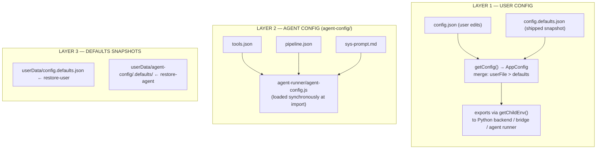
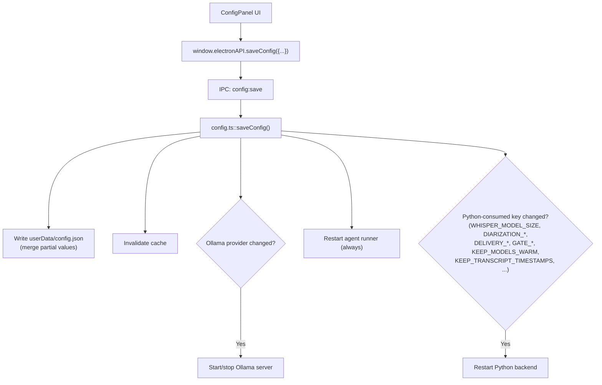
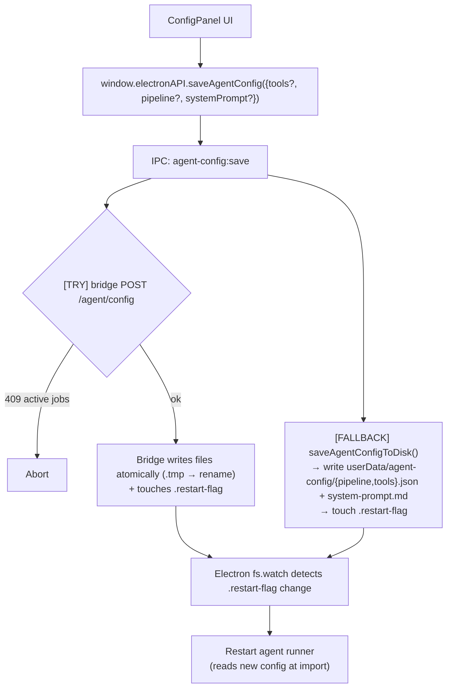
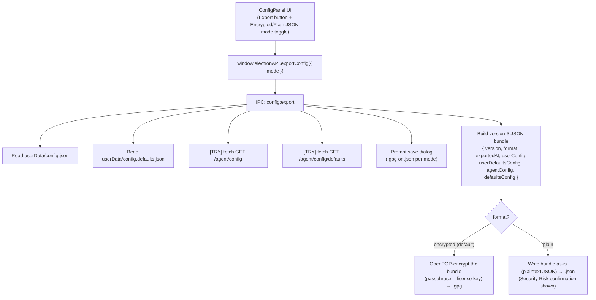
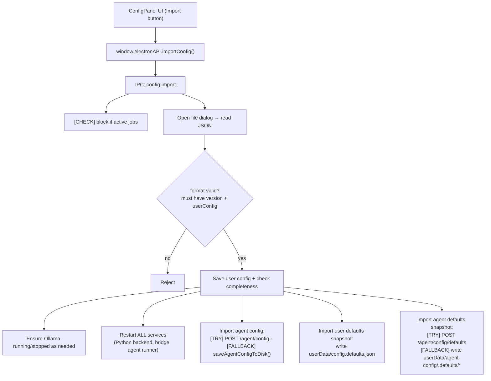
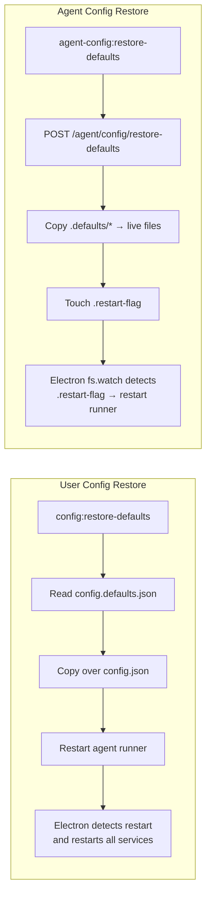

# Configuration Guide

A comprehensive reference for the Transcription Agent's configuration system — covering all three config layers, file locations, merge priority, IPC operations, import/export, defaults restoration, and data flows.

---

## Table of Contents

1. [Architecture Overview](#architecture-overview)
2. [Layer 1: User Config](#layer-1-user-config)
3. [Layer 2: Agent Config (Agent Instructions)](#layer-2-agent-config-agent-instructions)
4. [Layer 3: Defaults Snapshots](#layer-3-defaults-snapshots)
5. [Data Flow Diagrams](#data-flow-diagrams)
6. [Windows Compatibility](#windows-compatibility)
7. [IPC Reference](#ipc-reference)
8. [Config Key Reference](#config-key-reference)

---

## Architecture Overview

The application has three independent config layers that work together:



**Source:** [`getConfig()`](../../electron/src/main/config.ts#L647) · [`getChildEnv()`](../../electron/src/main/config.ts#L837) · [`agent-runner/agent-config.js`](../../agent-runner/agent-config.js#L1) · [`ensureUserConfigDefaults()`](../../electron/src/main/config.ts#L358)

---

## Layer 1: User Config

Controls API keys, LLM provider settings, delivery credentials, appearance, and feature toggles.

### File Locations

| File                                 | Purpose                        | Created                       |
| ------------------------------------ | ------------------------------ | ----------------------------- |
| `{userData}/config.json`             | User-saved overrides           | On first save via ConfigPanel |
| `{userData}/config.defaults.json`    | Shipped-defaults snapshot      | On first Electron launch      |
| `.env` (project root or `userData/`) | Environment variable overrides | Manual setup                  |

**`userData` path resolution:** the platform's standard per-user application-data
directory, resolved at runtime by the app (exact paths are intentionally not
published here).

### Merge Priority (highest → lowest)

If multiple sources define the same key, the highest-priority source wins:

1. **`config.json`** — Explicit user values (non-empty strings)
2. **`process.env`** — From `.env` file or host environment
3. **Hardcoded [`DEFAULTS`](../../electron/src/main/config.ts#L176)** — In [`config.ts`](../../electron/src/main/config.ts#L1)

The UI shows source annotations via [`getConfigWithSources()`](../../electron/src/main/config.ts#L657):

- `"user_config"` — value is in `config.json`
- `"environment"` — value is in `process.env`
- `"default"` — value is the hardcoded default

### How It Works

**File:** [`electron/src/main/config.ts`](../../electron/src/main/config.ts#L1)

```typescript
interface AppConfig {
  DEEPSEEK_API_KEY: string; // Required when API_PROVIDER=deepseek
  OPENAI_API_KEY: string; // Required when API_PROVIDER=openai
  ANTHROPIC_API_KEY: string; // Required when API_PROVIDER=anthropic
  LLM_PROVIDER: string; // "api" | "ollama" (cloud vs local)
  API_PROVIDER: string; // "deepseek" | "openai" | "anthropic" (when LLM_PROVIDER=api)
  DEEPSEEK_MODEL: string; // Per-provider model override (empty = built-in default)
  OPENAI_MODEL: string;
  ANTHROPIC_MODEL: string;
  OPENAI_BASE_URL: string; // Optional proxy/gateway override (empty = official)
  ANTHROPIC_BASE_URL: string;
  ANTHROPIC_MAX_TOKENS: string; // Default 4096
  OLLAMA_BASE_URL: string; // Ollama endpoint
  OLLAMA_MODEL: string; // Ollama model name
  OLLAMA_NUM_CTX: string; // Context window: 32768|65536|131072
  GMAIL_CLIENT_ID: string; // Gmail delivery OAuth (via in-app "Connect with Google" or config import)
  GMAIL_CLIENT_SECRET: string;
  GMAIL_REFRESH_TOKEN: string;
  GMAIL_USER: string;
  MS_CLIENT_ID: string; // Teams (Entra) OAuth — via in-app "Connect Microsoft Teams"
  MS_REFRESH_TOKEN: string;
  MS_USER: string;
  ZOOM_CLIENT_ID: string; // Zoom Marketplace OAuth — via in-app "Connect Zoom"
  ZOOM_CLIENT_SECRET: string;
  ZOOM_REFRESH_TOKEN: string;
  ZOOM_USER: string;
  TRELLO_KEY: string; // Trello delivery API key
  TRELLO_TOKEN: string;
  HUGGING_FACE_TOKEN: string; // For gated PyAnnote models
  GITHUB_TOKEN: string; // Private repo auto-updates
  EMBEDDING_PROVIDER: string; // "pyannote" | "speechbrain"
  WHISPER_MODEL_SIZE: string; // "medium" | "large"
  WHISPER_INITIAL_PROMPT_ENABLED: string;
  WHISPER_INITIAL_PROMPT: string;
  KEEP_TRANSCRIPT_TIMESTAMPS: string;
  LOG_LLM_DATA: string; // Debug logging toggle
  LOG_COLLAPSE_REPEATED_PREFIXES: string;
  LOG_CHROMIUM: string; // Route Chromium renderer/GPU logs to stderr (--enable-logging)
  LLM_TEMPERATURE: string; // 0.0–2.0
  PIPELINE_TIMEOUT_MINUTES: string;
  GATE_RAW_REVIEW_ENABLED: string;
  GATE_DELIVERY_REVIEW_ENABLED: string;
  KEEP_MODELS_WARM: string;
  DELIVERY_RECIPIENT_EMAILS: string;
  DELIVERY_EMAIL_SUBJECT: string;
  DELIVERY_EMAIL_ADDITIONAL_CONTENT: string;
  DELIVERY_DRIVE_FOLDER: string;
  APPEARANCE_THEME: string; // "dark" | "light"
  APPEARANCE_ACCENT_COLOR: string;
  APPEARANCE_FONT_SIZE: string; // "small" | "medium" | "large"
  APPEARANCE_SIDEBAR_WIDTH: string;
  PERF_METRICS_POLL_INTERVAL: string;
  CREDIT_POLL_INTERVAL: string;
  PLAYWRIGHT_AUDIO_FILE_PATH: string; // Test-only
  PLAYWRIGHT_TITLE_TEMPLATE: string;
  PLAYWRIGHT_GENERIC_NAMES: string;
}
```

### Key Operations

| Action                 | IPC Channel               | Code Path                     | What Happens                                                                                                                                                                  |
| ---------------------- | ------------------------- | ----------------------------- | ----------------------------------------------------------------------------------------------------------------------------------------------------------------------------- |
| **Read**               | [`config:get`](../../electron/src/main/index.ts#L1193)              | [`getConfig()`](../../electron/src/main/config.ts#L647)                 | Merges `config.json` → defaults, returns `AppConfig`                                                                                                                          |
| **Read with sources**  | [`config:getWithSources`](../../electron/src/main/index.ts#L1304)   | [`getConfigWithSources()`](../../electron/src/main/config.ts#L657)      | Same as above, but annotates each key with its source                                                                                                                         |
| **Save**               | [`config:save`](../../electron/src/main/index.ts#L1218)             | [`saveConfig(values)`](../../electron/src/main/config.ts#L706)          | Merges partial values into `config.json`, strips empty keys, invalidates cache. Restarts agent runner; also restarts the Python backend when any Python-consumed key changes. |
| **Clear**              | [`config:clear`](../../electron/src/main/index.ts#L1513)            | [`clearConfig()`](../../electron/src/main/config.ts#L697)               | Writes `{}` to `config.json` (all values → defaults). **Guard:** blocks if active jobs. Restarts agent runner + Python backend.                                               |
| **Restore defaults**   | [`config:restore-defaults`](../../electron/src/main/index.ts#L2022) | [`restoreUserConfigDefaults()`](../../electron/src/main/config.ts#L416) | Copies `config.defaults.json` over `config.json`. **Guard:** blocks if active jobs. Restarts agent runner + Python backend.                                                   |
| **Check completeness** | `config:check`            | `checkConfig()`               | Returns `{ok, missing[]}`. Requires the active provider's API key (deepseek/openai/anthropic) or `OLLAMA_MODEL` when local.                                                                       |

### Child Process Environment

[`getChildEnv()`](../../electron/src/main/config.ts#L837) in `config.ts` exports all config values to child processes (Python backend, bridge, agent runner). In **packaged (production)** mode, it also overrides storage paths to point inside `userData/`:

```typescript
// Only in app.isPackaged === true:
TRANSCRIPTION_STORAGE    → {userData}/storage
TRANSCRIPTION_QUEUE_DIR  → {userData}/queue
TRANSCRIPTION_TRIGGER_FILE → {userData}/queue/.transcription-trigger
```

> **Note:** `TRANSCRIPTION_QUEUE_DIR` now only stores the trigger file (`.transcription-trigger`). The event queue data itself lives in the `events` table of `{userData}/storage/ephemeral_memory.db`, which is the SQLite database shared by the Python backend and agent runner. This migration from JSONL to SQLite happened in 0.4.10.

In **development** mode, child processes use project-relative paths (`./storage/`, `./queue/`).

[`getChildEnv()`](../../electron/src/main/config.ts#L837) applies **`user config → process.env → DEFAULT`** precedence for every key: an explicit value in `config.json` wins; otherwise a `.env`/host env var wins; otherwise the hardcoded default. All `AppConfig` keys are forwarded to child processes, including `OLLAMA_NUM_CTX` (agent-runner context window), `PERF_METRICS_POLL_INTERVAL`/`CREDIT_POLL_INTERVAL` (renderer poll rates), and `LOG_COLLAPSE_REPEATED_PREFIXES`. `APP_VERSION` is always injected so children (e.g. the bridge's defaults snapshot) know the running app version.

---

## Layer 2: Agent Config (Agent Instructions)

Controls the LLM's tool definitions, pipeline step ordering, system prompt, and runtime constants.

### File Locations

| File (committed)                         | → Live File (gitignored)        | Runtime Location                           |
| ---------------------------------------- | ------------------------------- | ------------------------------------------ |
| `agent-config/pipeline.template.json`    | `agent-config/pipeline.json`    | `{userData}/agent-config/pipeline.json`    |
| `agent-config/tools.template.json`       | `agent-config/tools.json`       | `{userData}/agent-config/tools.json`       |
| `agent-config/system-prompt.template.md` | `agent-config/system-prompt.md` | `{userData}/agent-config/system-prompt.md` |
| `agent-config/.defaults/*` (committed)   | — (shipped defaults)            | `{userData}/agent-config/.defaults/*`      |
| `agent-config/schema.json`               | — (validation schema)           | —                                          |

### Initialization Flow

On first Electron launch, [`initAgentConfigDir()`](../../electron/src/main/backend-manager.ts#L352) in [`backend-manager.ts`](../../electron/src/main/backend-manager.ts#L1):

1. Checks if `{userData}/agent-config/` exists
2. If not, looks for bundled source in `extraResources/agent-config/`
3. Copies live files (`.json`, `.md`) or falls back to `.template.*` files
4. Seeds `{userData}/agent-config/.defaults/` from the bundled `.defaults/` (or from live files if no bundled snapshot exists), stamping `version.json`
5. On later launches, if `{userData}/agent-config/.defaults/version.json` differs from the running app version, refreshes `.defaults/` from the bundled snapshot (new defaults after an upgrade)

### What Each File Contains

#### `tools.json`

Array of tool definitions in OpenAI function-calling format:

```json
[
  {
    "name": "transcribe_refine",
    "description": "Clean a transcript...",
    "terminal": false,
    "handler": "bridge",
    "inputSchema": {
      "type": "object",
      "properties": { "jobId": { "type": "string" } },
      "required": ["jobId"]
    }
  }
]
```

Validated against `schema.json` (enforced by the ConfigPanel before saving):

- `name`: lowercase with underscores (`^[a-z_]+$`)
- `handler`: `"bridge"` (proxies to Python) or `"direct"` (external API)
- `terminal`: if `true`, calling this tool ends the pipeline
- `inputSchema`: JSON Schema for arguments

#### `pipeline.json`

Contains pipeline configuration:

| Key                          | Type     | Description                                          |
| ---------------------------- | -------- | ---------------------------------------------------- |
| `max_pipeline_steps`         | number   | Max iterations before forced stop (default: 40)      |
| `max_retries`                | number   | LLM call retry count (default: 6)                    |
| `retry_base_delay_ms`        | number   | Exponential backoff base (default: 4000)             |
| `ollama_max_retries`         | number   | Ollama-specific retry count (default: 5)             |
| `ollama_retry_base_delay_ms` | number   | Ollama-specific backoff base (default: 5000)         |
| `llm_context_window`         | number   | Step result blocks kept (0 = all)                    |
| `terminal_tools`             | string[] | Tools that end the pipeline                          |
| `pipeline_steps`             | array    | Ordered step definitions with enabled/disabled state |
| `pipeline_hints`             | object   | Step-to-step guidance for the LLM                    |
| `event_templates`            | object   | Message templates for job lifecycle events           |

Each **pipeline step** has:

- `id` — `"step-N"` pattern
- `toolName` — References a tool in `tools.json`
- `label` — Human-readable name (max 100 chars)
- `description` — Short description (max 200 chars)
- `systemPromptTemplate` — Per-step prompt override (max 500 chars)
- `hintTemplate` — Hint shown to LLM after step executes (max 500 chars)
- `enabled` — Whether the step is active
- `isTerminal` — Whether this step ends the pipeline.

#### `system-prompt.md`

The LLM system prompt template. Contains a `{{TOOL_LIST}}` placeholder that the agent runner replaces with the actual tool definitions at runtime.

#### `schema.json`

JSON Schema (draft-07) that validates `tools.json` (array of tool definitions) and `pipeline.json` (constants/steps/hints/event templates). A root `oneOf` selects between the two file shapes. The ConfigPanel validates the pipeline (and tool definitions) against this schema **before saving** — a malformed config is rejected with an inline error instead of being written to disk. A TS copy lives at [`electron/src/renderer/utils/agentConfigSchema.ts`](../../electron/src/renderer/utils/agentConfigSchema.ts#L1) — keep the two files in sync when editing either one.

### Agent Runner Loading

**File:** [`agent-runner/agent-config.js`](../../agent-runner/agent-config.js#L1)

All config files are read **synchronously** at import time for a consistent snapshot:

- No hot-reload — a runner restart is required to pick up changes
- Restart is triggered by writing `{userData}/agent-config/.restart-flag`

**Config directory resolution** (tried in order):

1. `agent-runner/../agent-config/`
2. `agent-runner/../../agent-config/`
3. `agent-runner/agent-config/`

**Fallback strategy (three layers):**

1. **Live file** in the resolved config dir (e.g. `{userData}/agent-config/tools.json`)
2. **Shipped defaults snapshot** at `{configDir}/.defaults/<file>` (seeded by [`initAgentConfigDir()`](../../electron/src/main/backend-manager.ts#L352) and refreshed on app upgrades) — used when the live file is missing or fails to parse
3. **Hardcoded [`FALLBACK_TOOLS`](../../agent-runner/agent-config.js#L103) / [`FALLBACK_PIPELINE`](../../agent-runner/agent-config.js#L339) / [`FALLBACK_SYSTEM_PROMPT`](../../agent-runner/agent-config.js#L491)** — a last-resort set that mirrors the shipped templates and always loads

The layered fallback means a corrupt live file (e.g. a bad edit) no longer drops the runner onto a stale hardcoded set — it loads the shipped defaults instead.

### Bridge REST API (port 5010)

The bridge server exposes CRUD endpoints for agent config management:

| Endpoint                         | Method | Purpose                                                                 | Guard                                |
| -------------------------------- | ------ | ----------------------------------------------------------------------- | ------------------------------------ |
| `/agent/config`                  | GET    | Returns live `{tools, pipeline, systemPrompt}` from disk                | —                                    |
| `/agent/config`                  | POST   | Writes tools/pipeline/systemPrompt files (atomic rename: `.tmp` → file) | ❌ Blocks if active ML pipeline jobs |
| `/agent/config/restart`          | POST   | Touches `{userData}/agent-config/.restart-flag`                         | —                                    |
| `/agent/config/defaults`         | GET    | Returns shipped defaults from `{userData}/agent-config/.defaults/`      | —                                    |
| `/agent/config/defaults`         | POST   | Writes to `{userData}/agent-config/.defaults/` (used during import)     | —                                    |
| `/agent/config/restore-defaults` | POST   | Copies `.defaults/*` over live config files, touches restart flag       | —                                    |

### Save Mechanism (Dual-Path)

Every agent-config save from the Electron main process uses a dual-path strategy:

1. **Primary:** POST to bridge server (`http://127.0.0.1:5010/agent/config`)
   - Bridge writes files atomically, touches `.restart-flag`
2. **Fallback:** Direct disk write via [`saveAgentConfigToDisk()`](../../electron/src/main/config.ts#L960) in `config.ts`
   - Writes directly to `{userData}/agent-config/`
   - Also touches `.restart-flag`

This ensures config changes work even when the bridge is restarting or on a clean install.

---

## Layer 3: Defaults Snapshots

Two independent snapshot systems, one per config layer:

### User Config Defaults

| File                              | Created                                                                                         | Contents                                                                                                                                                                        | Restored By                   |
| --------------------------------- | ----------------------------------------------------------------------------------------------- | ------------------------------------------------------------------------------------------------------------------------------------------------------------------------------- | ----------------------------- |
| `{userData}/config.defaults.json` | [`ensureUserConfigDefaults()`](../../electron/src/main/config.ts#L358) on first launch, then regenerated whenever the app version changes | Full `AppConfig` object + an internal `__version` stamp. First launch: hardcoded `DEFAULTS` merged with any existing `config.json` values. On upgrade: pure current `DEFAULTS`. | `config:restore-defaults` IPC |

### Agent Config Defaults

| Directory                            | Created                                                                                                   | Contents                                                                 | Restored By                                                                        |
| ------------------------------------ | --------------------------------------------------------------------------------------------------------- | ------------------------------------------------------------------------ | ---------------------------------------------------------------------------------- |
| `{userData}/agent-config/.defaults/` | [`snapshotDefaults()`](../../bridge-server/index.js#L38) on bridge startup + refreshed by [`initAgentConfigDir()`](../../electron/src/main/backend-manager.ts#L352) when the app version changes | `tools.json`, `pipeline.json`, `system-prompt.md` + `version.json` stamp | `agent-config:restore-defaults` IPC → bridge `POST /agent/config/restore-defaults` |

### How Defaults Are Used

**Export** reads both snapshots and includes them in the export file.
**Import** writes both snapshots from the import file, preserving them for future restore operations.
**Restore** copies the snapshot over the live config — this is a destructive, one-way operation.

Both snapshots carry a version stamp. When the app is upgraded to a new version, the snapshots are regenerated from the current shipped defaults, so **Restore defaults always restores the _current_ defaults** rather than the values frozen at install time.

---

## Data Flow Diagrams

### Save User Config



**Source:** [`config:save`](../../electron/src/main/index.ts#L1218) · [`saveConfig()`](../../electron/src/main/config.ts#L706)


### Save Agent Config (Agent Tab)



**Source:** [`agent-config:save`](../../electron/src/main/index.ts#L2217) · [`saveAgentConfigToDisk()`](../../electron/src/main/config.ts#L960)


### Export Config



**Source:** [`config:export`](../../electron/src/main/index.ts#L1571)


### Import Config



**Source:** [`config:import`](../../electron/src/main/index.ts#L1677)


### Restore Defaults



**Source:** [`config:restore-defaults`](../../electron/src/main/index.ts#L2022) · [`agent-config:restore-defaults`](../../electron/src/main/index.ts#L2269)


---

## Windows Compatibility

The config system is fully Windows-compatible. All cross-platform concerns are handled:

| Area                     | Implementation                                                                                       |
| ------------------------ | ---------------------------------------------------------------------------------------------------- |
| **Path construction**    | `path.join()` / `path.resolve()` everywhere — never hardcoded `/` or `\`                             |
| **Process spawning**     | `PYTHON_BIN`: `"python"` on Windows, `"python3"` on Unix. `NODE_BIN`: `"node.exe"` vs `"node"`       |
| **Process termination**  | `SIGTERM` on Unix, `taskkill /PID /T /F` on Windows                                                  |
| **Atomic file writes**   | `.tmp` → `fs.renameSync()` — atomic on both NTFS and APFS                                            |
| **Port detection**       | `netstat -ano \| findstr` on Windows, `lsof` on Unix                                                 |
| **Shell sleep**          | `timeout /t` on Windows, `sleep` on Unix                                                             |
| **Null device**          | `nul` on Windows, `/dev/null` on Unix                                                                |
| **Restart flag watcher** | Polling — checks `agent-config/.restart-flag` every 2s (fs.watch on a non-existent file never fires) |
| **File dialogs**         | Electron `dialog.showSaveDialog` / `showOpenDialog` — cross-platform                                 |
| **ConfigPanel UI**       | Pure React — no platform-specific code                                                               |
| **Bridge server**        | Pure HTTP — no platform-specific code                                                                |
| **Agent runner**         | No platform-specific code                                                                            |

> **Note:** The `.restart-flag` watcher polls every 2s for the flag file (created by the bridge `POST /agent/config/restart` and restore-defaults, or `saveAgentConfigToDisk`) and unlinks it in the poll callback so it can't re-trigger. The timer is cleared on quit.

---

## IPC Reference

### User Config

| Channel                   | Parameters               | Returns                                                                                                              | Guard          |
| ------------------------- | ------------------------ | -------------------------------------------------------------------------------------------------------------------- | -------------- |
| [`config:get`](../../electron/src/main/index.ts#L1193)              | —                        | `Record<keyof AppConfig, string>`                                                                                    | —              |
| [`config:save`](../../electron/src/main/index.ts#L1218)             | `Record<string, string>` | `Record<string, string>` (updated)                                                                                   | —              |
| [`config:check`](../../electron/src/main/index.ts#L1298)            | —                        | `{ok: boolean, missing: string[]}`                                                                                   | —              |
| [`config:clear`](../../electron/src/main/index.ts#L1513)            | —                        | `{success, error?, blocked?}`                                                                                        | ❌ Active jobs |
| [`config:getWithSources`](../../electron/src/main/index.ts#L1304)   | —                        | `Record<string, {value, source}>`                                                                                    | —              |
| `config:export`           | `{mode?: "encrypted"\|"plain"}` | `{success, filePath?, format?: "encrypted"\|"plain", error?, cancelled?, warnings?}`                            | —              |
| [`config:import`](../../electron/src/main/index.ts#L1677)           | —                        | `{success, filePath?, error?, cancelled?, blocked?, agentConfigImported?, defaultsImported?, userDefaultsImported?}` | ❌ Active jobs |
| [`config:defaults`](../../electron/src/main/index.ts#L2011)         | —                        | `{success, defaults}`                                                                                                | —              |
| [`config:restore-defaults`](../../electron/src/main/index.ts#L2022) | —                        | `{success, error?, blocked?}`                                                                                        | ❌ Active jobs |
| [`config:set-defaults`](../../electron/src/main/index.ts#L2117)     | —                        | `{success, agentDefaultsSaved?, error?, warnings?}`                                                                  | ❌ Active jobs |

### Agent Config

| Channel                         | Parameters                           | Returns                                      | Guard                          |
| ------------------------------- | ------------------------------------ | -------------------------------------------- | ------------------------------ |
| [`agent-config:get`](../../electron/src/main/index.ts#L2205)              | —                                    | `{tools?, pipeline?, systemPrompt?, error?}` | —                              |
| [`agent-config:save`](../../electron/src/main/index.ts#L2217)             | `{tools?, pipeline?, systemPrompt?}` | `{success?, written?, error?}`               | ⚠️ Bridge-side: ❌ Active jobs |
| [`agent-config:defaults`](../../electron/src/main/index.ts#L2257)         | —                                    | `{tools?, pipeline?, systemPrompt?, error?}` | —                              |
| [`agent-config:restore-defaults`](../../electron/src/main/index.ts#L2269) | —                                    | `{success?, restored[]?, error?}`            | ❌ Active jobs                 |
| [`agent-config:restart`](../../electron/src/main/index.ts#L2311)          | —                                    | `{success?, error?}`                         | —                              |

---

## Config Key Reference

### Required Keys

The required key depends on the active provider: `DEEPSEEK_API_KEY` (deepseek), `OPENAI_API_KEY` (openai), or `ANTHROPIC_API_KEY` (anthropic). If using Ollama, no API key is required, but `OLLAMA_MODEL` must be set — `config:check` reports the active provider's missing key otherwise.

### Default Values Summary

| Key                            | Default                      | Notes                                                                                                                                                                                      |
| ------------------------------ | ---------------------------- | ------------------------------------------------------------------------------------------------------------------------------------------------------------------------------------------ |
| `LLM_PROVIDER`                 | `"api"`                     | `"api"` (cloud) or `"ollama"` (local)                                                                                                                                          |
| `API_PROVIDER`                 | `"deepseek"`                | Cloud provider when `LLM_PROVIDER=api`: deepseek / openai / anthropic                                                                                                            |
| `OPENAI_API_KEY` / `ANTHROPIC_API_KEY` | `""`               | Required for their respective providers                                                                                                                                         |
| `DEEPSEEK_MODEL` / `OPENAI_MODEL` / `ANTHROPIC_MODEL` | `""` | Per-provider model overrides; empty = built-in default (deepseek-v4-flash, gpt-4o, claude-sonnet-4-5)                                                                             |
| `OPENAI_BASE_URL` / `ANTHROPIC_BASE_URL` | `""`              | Optional proxy/gateway base URL override; empty = official endpoint                                                                                                              |
| `ANTHROPIC_MAX_TOKENS`         | `"4096"`                    | Anthropic max output tokens                                                                                                                                                      |
| `OLLAMA_BASE_URL`              | `http://127.0.0.1:11434/v1`  | Ollama's OpenAI-compatible endpoint                                                                                                                                                        |
| `OLLAMA_NUM_CTX`               | `32768`                      | Also valid: `65536`, `131072`                                                                                                                                                              |
| `WHISPER_MODEL_SIZE`           | `"medium"`                   | Or `"large"` for higher accuracy                                                                                                                                                           |
| `EMBEDDING_PROVIDER`           | `"pyannote"`                 | Or `"speechbrain"`                                                                                                                                                                         |
| `LLM_TEMPERATURE`              | `"0.1"`                      | Range: 0.0 (deterministic) – 2.0 (creative)                                                                                                                                                |
| `PIPELINE_TIMEOUT_MINUTES`     | `"60"`                       | Pipeline timeout before forced fail                                                                                                                                                        |
| `APPEARANCE_THEME`             | `"dark"`                     | Or `"light"`                                                                                                                                                                               |
| `APPEARANCE_ACCENT_COLOR`      | `"#58a6ff"`                  | Any valid CSS color                                                                                                                                                                        |
| `APPEARANCE_FONT_SIZE`         | `"medium"`                   | Or `"small"`, `"large"`                                                                                                                                                                    |
| `DELIVERY_EMAIL_SUBJECT`       | `"Meeting Summary: {title}"` | `{title}` is replaced at send time                                                                                                                                                         |
| `DELIVERY_DRIVE_FOLDER`        | `"Meeting Transcripts"`      | Created automatically if missing                                                                                                                                                           |
| `GATE_RAW_REVIEW_ENABLED`      | `"false"`                    | Gate 1: pause after ASR                                                                                                                                                                    |
| `GATE_DELIVERY_REVIEW_ENABLED` | `"false"`                    | Gate 2: pause before delivery                                                                                                                                                              |
| `CUSTOM_DELIVERY_PER_MEETING`  | `"false"`                    | Custom delivery per meeting: pause at Gate 2 to pick which attendees receive the email (implies Gate 2). When off, deliver to all attendees.                                               |
| `DIARIZATION_TIMEOUT_MINUTES`  | `"60"`                       | Floor for the diarization subprocess timeout. The effective budget auto-scales to audio length (default ~2× duration), so this is a minimum. Raise it if long meetings time out at 60 min. |
| `KEEP_MODELS_WARM`             | `"false"`                    | Keep ML models loaded between jobs                                                                                                                                                         |
| `LOG_LLM_DATA`                 | `"false"`                    | Debug logging — writes LLM I/O to disk                                                                                                                                                     |
| `LOG_CHROMIUM`                 | `"true"`                     | Debug — routes Chromium renderer/GPU/console logs to stderr (restart required)                                                                                                             |
| `PERF_METRICS_POLL_INTERVAL`   | `"10000"`                    | Milliseconds                                                                                                                                                                               |
| `CREDIT_POLL_INTERVAL`         | `"60000"`                    | Milliseconds                                                                                                                                                                               |

---

## File Reference

### Source Files

| File                                               | Purpose                                                                           |
| -------------------------------------------------- | --------------------------------------------------------------------------------- |
| [`electron/src/main/config.ts`](../../electron/src/main/config.ts#L1)                      | User config management: DEFAULTS, get/save/clear/export/import/restore, child env |
| [`electron/src/main/backend-manager.ts`](../../electron/src/main/backend-manager.ts#L1)             | Agent config directory init, path resolution, process management                  |
| [`electron/src/main/index.ts`](../../electron/src/main/index.ts#L1)                       | IPC handlers for all config channels, restart-flag watcher, service orchestration |
| [`electron/src/main/preload.ts`](../../electron/src/main/preload.ts#L1)                     | `contextBridge.exposeInMainWorld("electronAPI", ...)` — all config IPC bindings   |
| [`electron/src/renderer/components/ConfigPanel.tsx`](../../electron/src/renderer/components/ConfigPanel.tsx#L1) | UI: config tab, agent tab, logging tab, export/import/clear/restore buttons       |
| [`agent-runner/agent-config.js`](../../agent-runner/agent-config.js#L1)                     | Agent config loading: sync file read, fallback defaults, CONFIG_DIR resolution    |
| [`bridge-server/index.js`](../../bridge-server/index.js#L1)                           | Bridge REST API: agent config CRUD, defaults snapshot, restart flag               |

### Config Data Files

| File                                                 | Layer | Purpose                                                   |
| ---------------------------------------------------- | ----- | --------------------------------------------------------- |
| `{userData}/config.json`                             | 1     | User-saved config values                                  |
| `{userData}/config.defaults.json`                    | 3     | Shipped user-config defaults snapshot                     |
| `{userData}/agent-config/tools.json`                 | 2     | Tool definitions                                          |
| `{userData}/agent-config/pipeline.json`              | 2     | Pipeline steps, hints, constants                          |
| `{userData}/agent-config/system-prompt.md`           | 2     | LLM system prompt template                                |
| `{userData}/agent-config/.defaults/tools.json`       | 3     | Shipped agent-config defaults snapshot                    |
| `{userData}/agent-config/.defaults/pipeline.json`    | 3     | Shipped agent-config defaults snapshot                    |
| `{userData}/agent-config/.defaults/system-prompt.md` | 3     | Shipped agent-config defaults snapshot                    |
| `{userData}/agent-config/.restart-flag`              | —     | Signal file watched by Electron → triggers runner restart |
| `agent-config/schema.json`                           | —     | Validation schema (source of truth)                       |
| `agent-config/*.template.*`                          | —     | Committed templates (copied to live files on fresh clone) |

---

## Troubleshooting

### "Agent config not found" warnings at startup

The agent runner logs warnings if config files are missing. This is normal on first run — the fallback defaults are used. Once the bridge server starts, it snapshots defaults and the files are written.

### "Cannot edit agent instructions while jobs are running"

The bridge server prevents agent config edits when any ML pipeline job is active. Wait for jobs to complete or cancel them.

### "Cannot import/clear/restore/save-defaults configuration while jobs are running"

The Electron main process prevents import, clear, restore, and save-as-defaults operations when active jobs exist
(`config:set-defaults` and `agent-config:restore-defaults` are also guarded). In the UI, the Export/Import/Clear
header buttons and the Cloudflare Tunnel Start/Stop/Force Stop buttons are disabled while jobs run. Same solution: wait or cancel.

### Runner doesn't pick up config changes

After saving agent config:

1. The bridge (or direct write) touches `{userData}/agent-config/.restart-flag`
2. Electron's `fs.watch` detects the change
3. Electron restarts the agent runner

If the runner doesn't restart, check:

- The `.restart-flag` file exists
- The `fs.watch` is active (check main process logs)
- The runner PID file is present — the agent runner writes `agent-runner.pid` to the OS temp directory (`os.tmpdir()`)

### Config values not taking effect

Check the source annotation via `getConfigWithSources()` in the UI. A value showing `"default"` or `"environment"` may need to be saved explicitly in the ConfigPanel to override.
