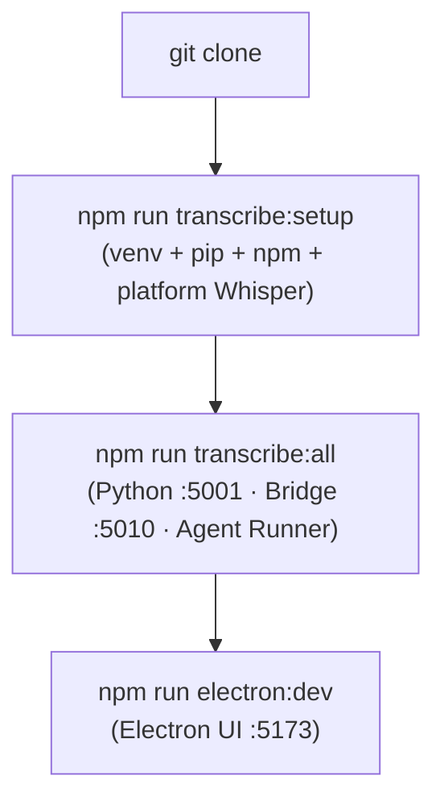
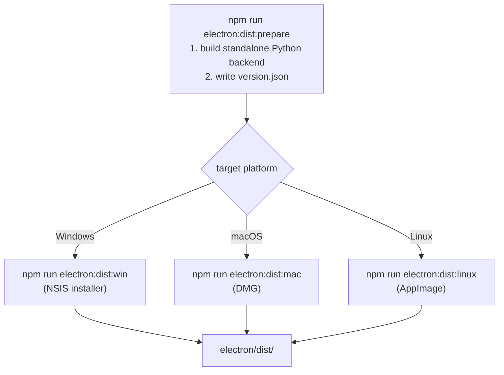

# Development Setup & Installation

This guide covers setting up the Transcription Agent for development, running individual services, and building distributable packages.

---

## Prerequisites

| Requirement | Version | Notes                                                 |
| ----------- | ------- | ----------------------------------------------------- |
| **Python**  | 3.10+   | Required for ML backend                               |
| **Node.js** | 22 LTS  | Required for bridge, agent runner, and Electron       |
| **npm**     | 10+     | Comes with Node.js                                    |
| **FFmpeg**  | Latest  | For audio standardization (auto-installed if missing) |
| **Git**     | Latest  | Required for dev-mode auto-updates                    |

---

## Quick Start (Full Stack)

```bash
# Clone the repository
git clone <repo-url>
cd ai_transcription_agent

# Run the full setup script (venv, pip, npm, platform Whisper)
npm run transcribe:setup

# Start all three backend services
npm run transcribe:all

# In a separate terminal, start the Electron UI
npm run electron:dev
```



**Source:** [`package.json`](../package.json#L1)

---

## Step-by-Step Setup

### 1. Python Backend

```bash
cd python-backend

# Create virtual environment
python3 -m venv venv
source venv/bin/activate

# Install base dependencies
pip install -r requirements.txt

# Platform-specific Whisper variant is installed by the setup script,
# but you can install manually:
#   macOS Apple Silicon:
pip install mlx-whisper
#   Windows / Linux:
pip install faster-whisper
#   Fallback (any platform):
pip install openai-whisper
```

### 2. Node.js Services

```bash
# Agent Runner
cd agent-runner
npm install

# Bridge Server
cd ../bridge-server
npm install

# Electron App
cd ../electron
npm install
```

### 3. Configuration

Create a `.env` file in the project root:

```env
# Required: LLM API Key for your chosen cloud provider
DEEPSEEK_API_KEY=sk-your-key-here
# OPENAI_API_KEY=sk-...
# ANTHROPIC_API_KEY=sk-ant-...

# Optional: Ollama (local LLM)
LLM_PROVIDER=ollama
OLLAMA_BASE_URL=http://127.0.0.1:11434/v1
OLLAMA_MODEL=qwen3.6

# Optional: LLM inference parameters
LLM_TEMPERATURE=0.1

# Required for gated models (pyannote diarization)
HUGGING_FACE_TOKEN=hf_your_token

# Optional: GitHub PAT for private repo auto-updates
GITHUB_TOKEN=

# Optional: Service credentials
GMAIL_CLIENT_ID=...
GMAIL_CLIENT_SECRET=...
GMAIL_REFRESH_TOKEN=...
TRELLO_KEY=...
TRELLO_TOKEN=...
```

### 4. Hugging Face Token

The pyannote/speaker-diarization-3.1 model is gated. You need:

1. A Hugging Face account
2. Accept the model license at https://huggingface.co/pyannote/speaker-diarization-3.1
3. Generate a token at https://huggingface.co/settings/tokens
4. Set `HUGGING_FACE_TOKEN` in `.env` or in the ConfigPanel

---

## Running for Development

### Option A: All services (recommended)

```bash
# Terminal 1: Start all backend services
npm run transcribe:all

# Terminal 2: Start Electron UI
npm run electron:dev
```

### Option B: Individual services

```bash
# Terminal 1: Python Backend (:5001)
npm run transcribe:backend

# Terminal 2: Bridge Server (:5010)
npm run transcribe:bridge

# Terminal 3: Agent Runner
npm run transcribe:runner

# Terminal 4: Electron UI (:5173)
npm run electron:dev
```

### Option C: Backend only (no UI)

```bash
# Start all three backend services
npm run transcribe:all

# The bridge and Python backend run on their local dev ports. For day-to-day
# testing, upload an audio file through the app UI rather than via raw HTTP.
```

---

## Building for Distribution

### Prerequisites

```bash
# First-time dist preparation:
# 1. Builds standalone Python backend
# 2. Writes version.json
npm run electron:dist:prepare
```

> **Windows build note:** The `dist:prepare` script and its dependencies (`write-version.sh`, `build-python-backend.sh`) are **bash scripts** that require a Unix-compatible shell. On Windows, run the build from **Git Bash** (comes with Git for Windows) or **WSL**. The scripts already detect MINGW/MSYS/CYGWIN environments and handle Windows paths and binaries (`.exe` suffixes, `taskkill`, etc.) correctly.

### Platform-Specific Builds

```bash
# Windows (NSIS installer)
npm run electron:dist:win

# macOS (DMG)
npm run electron:dist:mac

# Linux (AppImage)
npm run electron:dist:linux
```

The built installers are output to `electron/dist/`.



**Source:** [`dist:prepare`](../electron/package.json#L17) · [`dist:win`/`dist:mac`/`dist:linux`](../electron/package.json#L18) · [`build-python-backend.sh`](../scripts/build-python-backend.sh#L1) · [`write-version.sh`](../scripts/write-version.sh#L1)

---

## Running Playwright Tests

The Electron app includes a suite of Playwright screenshot tests that capture every UI panel for documentation.

### Prerequisites

1. **Build the Electron app** (the test launches its own instance from the built output):

   ```bash
   cd electron
   npm run build
   ```

2. **Backend services running** (Python :5001, Bridge :5010):

   ```bash
   npm run transcribe:all
   ```

3. **Audio test file** — set the path to an audio file (MP3, WAV) via config or env var.

### Running Tests

```bash
cd electron

# Run screenshot tests (headed, for visual confirmation)
npm run screenshots

# Run screenshot tests headless
npm run screenshots:headless

# Run all Playwright tests
npm test
```

### Configuring Test Variables

Test variables can be set in three ways (priority: env var > config.json > hardcoded default):

1. **DevPanel Testing tab** — open Dev Tools → Testing tab, edit fields, click Run
2. **Settings → Testing section** — persist in config.json via ConfigPanel
3. **Environment variables** — set before running:
   ```bash
   PLAYWRIGHT_AUDIO_FILE_PATH=/path/to/audio.mp3 \
   PLAYWRIGHT_TITLE_TEMPLATE="Sprint Review {autoNum}" \
   PLAYWRIGHT_GENERIC_NAMES="Alex,Blake,Casey,Drew,Ellis,Finley,Gray,Harper,Indigo,Jade,Kai,Logan,Morgan,Nico,Oakley,Parker,Quinn,Reese,Skyler,Taylor" \
   npx playwright test tests/screenshots/
   ```

### How It Works

When you open the DevPanel Testing tab:

1. **Live prerequisite checks** poll every 10 seconds — backend services (Python, Bridge, Agent), audio file existence, and the 20-name requirement are shown with green/red indicators
2. **Audio file path** can be set by typing or using the native file picker (Browse button)
3. **20 generic speaker names** are editable in a textarea — must contain at least 20 entries

When you click **Run Tests**:

1. Test variables are saved to `config.json`
2. Playwright is spawned with those values as environment variables (`PLAYWRIGHT_AUDIO_FILE_PATH`, `PLAYWRIGHT_TITLE_TEMPLATE`, `PLAYWRIGHT_GENERIC_NAMES`)
3. The test file reads them via `process.env.PLAYWRIGHT_*`
4. Real-time output streams back to the Testing tab
5. Exit code and pass/fail status are displayed

### Screenshot Output

Screenshots are saved to **timestamped subdirectories** under `docs/screenshots/`:

```
docs/screenshots/
├── 2026-07-14/            ← today's run
│   ├── 01-main-window-empty.png
│   ├── 02-upload-panel.png
│   └── ...
├── 2026-07-13/            ← previous run
│   ├── 01-main-window-empty.png
│   └── ...
├── 01-main-window-empty.png   ← latest (copied from today's run)
├── 02-upload-panel.png        ← latest
└── ...
```

After all tests complete, PNGs are **copied** from the dated folder to the root `docs/screenshots/` directory. The user guide's markdown links (e.g. ``) always point to the most recent run, while prior runs remain accessible in their date folders.

### Build Configuration

The electron-builder config is in `electron/package.json`:

| Setting         | Value                                                       |
| --------------- | ----------------------------------------------------------- |
| App ID          | `com.transcription.agent`                                   |
| Product Name    | `Transcription Agent`                                       |
| Publisher       | GitHub Releases (`afrogenesurvive/ai_transcription_agent`)  |
| Windows Target  | NSIS (per-machine install)                                  |
| macOS Target    | DMG (x64 + arm64)                                           |
| Extra Resources | Python backend, Node.js binary, bridge server, agent runner |

---

## Service Ports

| Service         | Port   | Health Endpoint                    |
| --------------- | ------ | ---------------------------------- |
| Python Backend  | `5001` | `GET http://127.0.0.1:5001/health` |
| Bridge Server   | `5010` | `GET http://127.0.0.1:5010/health` |
| Vite Dev Server | `5173` | (Electron dev mode only)           |

---

## Scripts Reference

### Root `package.json`

| Script                | Description                           |
| --------------------- | ------------------------------------- |
| `transcribe:backend`  | Start Python backend                  |
| `transcribe:bridge`   | Start bridge server                   |
| `transcribe:runner`   | Start agent runner                    |
| `transcribe:all`      | Start all three services concurrently |
| `transcribe:setup`    | Full first-time setup                 |
| `electron:dev`        | Start Electron in dev mode            |
| `electron:build`      | Build Electron app                    |
| `electron:dist:win`   | Build Windows installer               |
| `electron:dist:mac`   | Build macOS DMG                       |
| `electron:dist:linux` | Build Linux AppImage                  |

### `electron/package.json`

| Script                                 | Description                                       |
| -------------------------------------- | ------------------------------------------------- |
| `dev`                                  | Full dev mode (renderer + main + electron)        |
| `build`                                | TypeScript + Vite build                           |
| `dist:prepare`                         | Pre-build setup (version, Node.js, Python bundle) |
| `dist:win` / `dist:mac` / `dist:linux` | Platform-specific builds                          |
| `test`                                 | Playwright E2E tests                              |
| `screenshots`                          | Playwright screenshot tests                       |

---

## Troubleshooting

### "MPS backend out of memory" on macOS

The app sets `PYTORCH_MPS_HIGH_WATERMARK_RATIO=0.0` to disable PyTorch's MPS memory limit. If you still see OOM errors, try:

- Reducing `WHISPER_MODEL_SIZE` to `medium` or `small`
- Processing shorter audio files
- Closing other GPU-intensive applications

### "Weights only load failed" during diarization

The app has a monkey-patch (`patches.py`) that forces `weights_only=False` for `torch.load`. If pyannote checkpoints still fail to load, ensure you've accepted the model license on Hugging Face.

### "Connection refused" at `:5001`

1. Check if the Python backend is running
2. Ensure the virtual environment is activated
3. Check for port conflicts with `lsof -ti:5001`

### "Agent runner not picking up jobs"

1. Check that `queue/.transcription-trigger` exists
2. Check agent runner logs for startup errors
3. Ensure the queue directory is writable
4. Restart the agent runner
