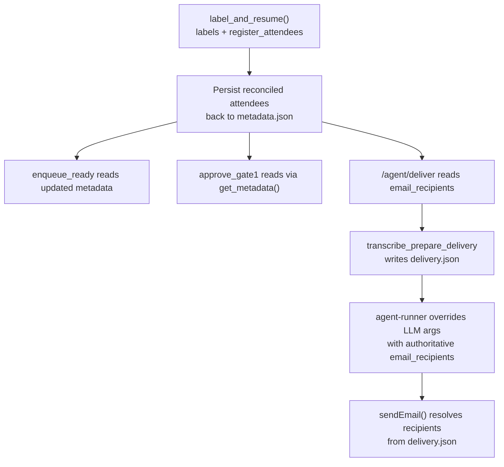
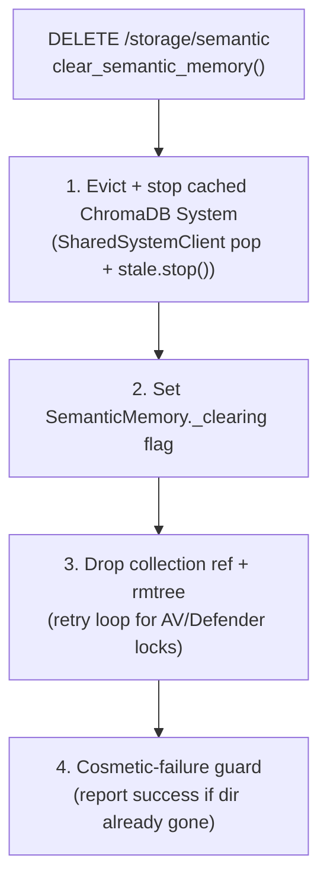

# Known Bugs & Fixes

## Windows/CrossOver: Backend crashes at startup with `UnicodeEncodeError` (cp1252 can't encode emoji)

### Symptom

- Packaged Windows app (under CrossOver or any standard Windows install) opens a **blank window**.
- After a short wait the app shows a **"Backend Error"** dialog:
  `Failed to start backend: Server at the backend health check did not start — process exited before becoming ready.`
- `{userData}/logs/startup-error.log` contains:

```
Traceback (most recent call last):
  File "main.py", line 36, in <module>
  File "patches.py", line 50, in <module>
  File "encodings\cp1252.py", line 19, in encode
UnicodeEncodeError: 'charmap' codec can't encode character '\u2705' in position 10: character maps to <undefined>
[PYI-40:ERROR] Failed to execute script 'main' due to unhandled exception!
```

### Root Cause

The Electron main process spawns the Python backend with piped stdio
(`backend-manager.ts` → `startPythonBackend()`). On Windows, Python's piped
stdout defaults to the ANSI code page (`cp1252` on en-US) — there is no UTF-8
console and no `PYTHONUTF8`/`PYTHONIOENCODING` was being set. The backend's
startup prints use emoji (first hit: `patches.py:50`
`print("[patches] ✅ ...")`), which `cp1252` cannot encode, so the very first
`print()` raises `UnicodeEncodeError` and the whole backend exits before the
health check can succeed. The Electron window renders immediately (so it looks
blank) and the backend never becomes ready. 60+ other emoji `print()` sites
(`transcription.py`, `voiceprint.py`, `ephemeral_memory.py`, `semantic_memory.py`,
`upload.py`) would crash the same way one-by-one, so the encoding fix is mandatory.

macOS dev is unaffected (locale is UTF-8). This is **not** related to CrossOver's
D3D Metal graphics setting — the `d3dmetal` backend initializes fine; it's a
console/stdout encoding issue that also affects real Windows installs.

### Fix

**1. `python-backend/main.py`** — force UTF-8 before `import patches`:

```python
os.environ.setdefault("PYTHONUTF8", "1")
for _stream in (sys.stdout, sys.stderr):
    if _stream is not None:
        _stream.reconfigure(encoding="utf-8", errors="replace")
```

**2. `electron/src/main/backend-manager.ts`** — `startPythonBackend()` spawn env:

```ts
PYTHONUTF8: "1",
PYTHONIOENCODING: "utf-8",
```

`PYTHONUTF8=1` also propagates UTF-8 mode to subprocesses the backend spawns
(whisper/diarization), which also print emoji.

**Rebuild:** trigger `.github/workflows/build-win.yml` (manual dispatch or a `v*`
tag) to produce a new Windows installer; reinstall and re-test.

## Windows/CrossOver: Blank window — renderer runs but compositor never paints

### Symptom

- Packaged Windows app (under CrossOver) opens a **blank window** (grey with a small
  white box at top-left once the renderer starts), with **no `startup-error.log`** and a
  healthy backend — files keep appearing in storage and the Python backend/bridge respond.
- Launching Chromium with its remote-debugging flag (`--remote-debugging-port`) shows a **page target**
  (`file:///.../app.asar/dist/renderer/index.html`) — so the renderer **is** running and the
  HTML loaded, and `document.getElementById('root').childElementCount` is > 0 (React
  mounted). Yet the window stays blank: the compositor never presents frames.
- `{userData}/logs/chromium.log` shows **only browser-process lines** — NOT a reliable
  renderer-state signal under Wine (it looks identical even when the UI renders).

### Root Cause

Under Wine/CrossOver the Chromium **compositor/paint path** fails: the D3D11 GPU process
crashes (0xC0000005) and, as verified on 0.6.10, the software compositor still doesn't
present frames even with `disableHardwareAcceleration()` + `disable-gpu-compositing`. The
renderer runs and React mounts, but nothing is painted. This was initially misdiagnosed as
the Chromium **sandbox** (which Wine also doesn't implement); that sandbox work was a red
herring — confirmed by the `:9222/json` page target appearing **without** any `--no-sandbox`
flag, and the window rendering when `--disable-gpu --in-process-gpu` were added.

### Fix

**`electron/src/main/index.ts`** — force fully software compositing on **all win32 builds**:
`--disable-gpu` + `--in-process-gpu` (verified on 0.6.10 under CrossOver — window paints).
Because `app.commandLine.appendSwitch()` is read too late for BOTH the renderer sandbox and
the GPU feature config under Wine (verified: switches only took effect when passed on the
launch command), the app **relaunches itself once** with the required switches on the real
OS command line:

```ts
// index.ts (win32): if the switches are missing from process.argv, relaunch with them.
const required = ["no-sandbox", "disable-gpu", "disable-gpu-compositing", "in-process-gpu"];
// ELECTRON_ENABLE_SANDBOX=1 drops "no-sandbox". Guarded by TRANS_AGENT_RELAUNCHED=1.
const missing = required.filter((s) => !process.argv.includes(`--${s}`));
if (process.platform === "win32" && missing.length && process.env.TRANS_AGENT_RELAUNCHED !== "1") {
  process.env.TRANS_AGENT_RELAUNCHED = "1";
  app.relaunch({ args: [...missing.map((s) => `--${s}`), ...process.argv.slice(1)] });
  app.exit(0);
}
```

The win32 block also keeps `app.disableHardwareAcceleration()` + the `appendSwitch(...)`
calls and `webPreferences.sandbox: false` as first-instance belt-and-suspenders.
`ELECTRON_ENABLE_SANDBOX=1` keeps the sandbox on native Windows. (The GPU flags also apply
to native Windows — accepted tradeoff for this local-content app.)

### Diagnosis pointers

- The authoritative renderer check is to inspect the Chromium page target (launch with
  `--remote-debugging-port`) and confirm the root element has children. `document.getElementById('root').childElementCount`: 0 = JS didn't run; >0 = React
  mounted → a blank window then means compositor, not renderer/JS.
- **Don't judge renderer state from `chromium.log` under Wine** — it captures only
  browser-process lines even when the UI renders. Use the page-target check instead.
- Remote DevTools WebSocket needs `--remote-allow-origins=*` (Chromium 111+ origin
  allowlist) or use in-app DevTools via Ctrl+Shift+I (devTools isn't disabled).
- Fast flag-test loop (no rebuild): launch the exe with candidate flags appended, e.g.
  `--disable-gpu --in-process-gpu`, and see if the window paints.

### Notes

- The win32 GPU block also applies to **native Windows** (gated only on `process.platform`).
  If native Windows should keep GPU compositing, gate that block behind a Wine check.

## Windows/CrossOver: Diarization unavailable — packaged backend missing lightning_fabric/version.info

### Symptom

- UI shows **Diarization Model: unavailable**; `models/status` returns
  `diarization_error: "Model failed to load: [Errno 2] No such file or directory:
'C:\\Program Files\\Transcription Agent\\resources\\python-backend\\main\\_internal\\lightning_fabric\\version.info'"`.
- The traceback shows an **import** failure (`import pyannote.audio` → `pytorch_lightning` →
  `lightning_fabric` reading `version.info`) — **not** a model-download failure. The model is
  never even reached.

### Root Cause

The PyInstaller build bundles only Python modules via `--hidden-import`. `lightning_fabric/`
(and `pytorch_lightning/`) ship a `version.info` **data file** read at import time, which is
not collected into the bundle → `import pyannote.audio` crashes with FileNotFoundError.

### Fix

`.github/workflows/build-win.yml` and `scripts/build-python-backend.sh` — add
`--collect-all lightning_fabric --collect-all pytorch_lightning --collect-all pyannote.audio`
to the PyInstaller command so data files + dynamically-imported submodules are bundled.
Rebuild the Windows installer and reinstall.

### Diagnosis

Read the real error via `curl http://127.0.0.1:5001/transcribe/models/status` and inspect
`diarization_error` / `diarization_traceback` — that cleanly distinguishes an
import/packaging bug from a download failure or a missing HF token.

## Diarization unavailable — torchaudio 2.9+ removed AudioMetaData (breaks pyannote.audio import)

### Symptom

`models/status` returns `diarization_error: "PyTorch/torchaudio compatibility issue: module
'torchaudio' has no attribute 'AudioMetaData'"`. Traceback ends at
`pyannote/audio/core/io.py` → `) -> torchaudio.AudioMetaData:` →
`AttributeError: module 'torchaudio' has no attribute 'AudioMetaData'`.

### Root Cause

`pyannote.audio` evaluates `torchaudio.AudioMetaData` in a type annotation at import time.
`torchaudio` removed `AudioMetaData` (with the deprecated backend utils) in **2.9**. The
requirements used two-component `~=` pins (`torch~=2.8` / `torchaudio~=2.8`, which mean
`>=2.8,<3.0`), so a fresh `pip install` resolves to 2.9+ and the import breaks. Dev machines
that happen to have exactly 2.8.0 work, masking the bug.

### Fix

`python-backend/requirements.txt` — pin `torch~=2.8.0` and `torchaudio~=2.8.0` (three-component
`~=` restricts to `<2.9`). Rebuild the Windows installer and reinstall.

### Diagnosis

`curl http://127.0.0.1:5001/transcribe/models/status` and inspect `diarization_error` /
`diarization_traceback`. Compare with the dev venv: `python -c "import torchaudio; print(torchaudio.__version__, hasattr(torchaudio, 'AudioMetaData'))"`.

## PyTorch MPS High Watermark Ratio — Invalid Low Watermark (macOS Apple Silicon)

### Error

```
[transcription] ❌ Failed to load diarization model: invalid low watermark ratio 1.4
```

Or from the bridge:

```json
{"error":"Memory search failed: invalid low watermark ratio 1.4"}
{"error":"Save context failed: invalid low watermark ratio 1.4"}
```

### Root Cause

The `PYTORCH_MPS_HIGH_WATERMARK_RATIO` environment variable was set to `"0.7"` in `electron/src/main/backend-manager.ts` when spawning the Python backend. This env var tells PyTorch's MPS (Metal Performance Shaders) allocator at what ratio of VRAM usage to begin reclaiming memory.

In PyTorch 2.8.0, setting `PYTORCH_MPS_HIGH_WATERMARK_RATIO=0.7` triggered an internal bug where the allocator calculated the **low watermark** (the target level to reclaim down to) as `0.7 × 2 = 1.4`. Since a ratio of 1.4 exceeds the valid range of `[0.0, 1.0]`, PyTorch's MPS allocator rejected it with `"invalid low watermark ratio 1.4"`.

This error surfaced in two places depending on the context:

- **Diarization model loading:** `Pipeline.from_pretrained()` internally loads PyTorch models onto the MPS device, triggering the allocator validation during tensor allocation.
- **ChromaDB Rust bindings (1.5.x):** The `chromadb_rust_bindings.abi3.so` compiled Rust code had a separate, coincidentally identical `"invalid low watermark ratio 1.4"` error when initializing its HNSW index. This was a different bug with the same error string.

Both bugs independently caused failures in the transcription pipeline.

### Fix

**1. PyTorch MPS (all macOS Apple Silicon systems)**

Remove the `PYTORCH_MPS_HIGH_WATERMARK_RATIO` override from `backend-manager.ts` so PyTorch uses its internal default:

```ts
// Before (lines 377-378):
      PYTORCH_MPS_HIGH_WATERMARK_RATIO: "0.7",
      // PYTORCH_MPS_HIGH_WATERMARK_RATIO: "0.0",

// After (both commented out):
      // PYTORCH_MPS_HIGH_WATERMARK_RATIO: "0.7",
      // PYTORCH_MPS_HIGH_WATERMARK_RATIO: "0.0",
```

The Python backend's `main.py` has a `setdefault("PYTORCH_MPS_HIGH_WATERMARK_RATIO", "0.7")` which will apply automatically when the env var is absent from the parent process. The `"0.7"` value provides a catchable OOM error at ~70% MPS usage instead of a hard macOS SIGKILL.

**2. ChromaDB Rust bindings (all platforms if using chromadb 1.5.x)**

The `chromadb_rust_bindings.abi3.so` (or `.pyd` on Windows) bundled with chromadb 1.5.0–1.5.9 has a bug in its HNSW index initialization that produces the same error string. Fix: downgrade to chromadb 1.4.1 with `chroma-hnswlib`:

```bash
cd python-backend
source venv/bin/activate
# Nuke old 1.5.x remnants and install 1.4.1
rm -rf venv/lib/python3.9/site-packages/chromadb*
rm -rf venv/lib/python3.9/site-packages/chromadb_rust_bindings
pip install "chromadb==1.4.1" "chroma-hnswlib==0.7.6"
```

### Affected Versions

| Component              | Affected Versions                                              | Platforms                   |
| ---------------------- | -------------------------------------------------------------- | --------------------------- |
| PyTorch MPS            | 2.8.0 (with `PYTORCH_MPS_HIGH_WATERMARK_RATIO` set explicitly) | macOS (Apple Silicon)       |
| chromadb Rust bindings | 1.5.0 through 1.5.9                                            | all (macOS, Windows, Linux) |

### Historical Context

The `PYTORCH_MPS_HIGH_WATERMARK_RATIO: "0.7"` was originally added to `backend-manager.ts` during the Electron shell migration, intended to provide catchable OOM errors instead of hard macOS SIGKILL crashes. It was commented out when PyTorch 2.8.0 introduced the low watermark validation that rejected the derived value of 1.4.

---

## Labeled Attendees (from Diarization Labeling Modal) Don't Receive Email Delivery

### Error

After diarization detects more speakers than upload-form attendees (e.g., 3 speaker clusters from a 2-person meeting), the labeling modal lets the user name the extra speaker. That attendee is registered in the ephemeral DB's `attendees` table but **never receives an email delivery** — only the original upload-form attendees get one.

The attendee shows up in the UploadPanel's "Registered attendees" list (with their email), but only the original attendees appear in the agent runner context and delivery results.

### Root Cause

In `label_and_resume()` (`python-backend/main.py`), after the user labels unknown speakers, the code calls:

```python
metadata = uploader.get_metadata(job_id)  # ← loads ORIGINAL upload metadata
agent_bridge.enqueue_ready(job_id, aligned, metadata, ...)
```

The `metadata.json` on disk only has the pre-labeling attendee list (e.g., 2 attendees from the upload form). The newly labeled attendee is saved to the ephemeral DB's `attendees` table but **never written back to `metadata.json`**. All downstream consumers (`enqueue_ready`, `approve_gate1`, `/agent/deliver`) read the stale metadata and never see the 3rd attendee — so the LLM doesn't send them an email.

### Fix

Applied in commit (2026-07-22). In `label_and_resume()`, after the `register_attendees` call succeeds, persist the reconciled attendee list back to `metadata.json`:

```python
metadata["attendees"] = all_attendee_names
metadata["attendeeEmails"] = dict(zip(all_attendee_names, all_attendee_emails))

# Merge new real emails into email_recipients (skip @voiceprint.local placeholders)
existing_recipients = set(e.lower() for e in metadata.get("email_recipients", []) if e)
for email in all_attendee_emails:
    if email and "@voiceprint.local" not in email:
        existing_recipients.add(email.lower())
metadata["email_recipients"] = list(existing_recipients)

meta_path = os.path.join(config.STORAGE_PATH, job_id, "metadata.json")
with open(meta_path, "w") as f:
    json.dump(metadata, f, indent=2)
```

This fixes three downstream call sites with one change:

1. `label_and_resume` → `enqueue_ready` reads updated metadata immediately
2. `approve_gate1` → reads from disk via `get_metadata()`
3. `/agent/deliver` → reads `email_recipients` from `metadata.json`

### Residual gap (fixed in 0.5.10-10): LLM could still drop recipients

Even after the write-back fix, a job with a manually-labeled 4th attendee could still deliver to only **one** recipient. The recipient list was correct everywhere (`metadata.json`, `delivery.json`, and the Gate 2 review context all listed every recipient), but the LLM's `send_delivery_email` call sometimes passed only the first address it saw (e.g. `deepseek-v4-flash` returning a single `to`). Nothing enforced sending to the full configured list.

**Fix (0.5.10-10, `agent-runner/`):** before executing `send_delivery_email`, the runner reads the job's `delivery.json` (written by `transcribe_prepare_delivery`) and overrides the LLM's args with the authoritative `email_recipients` (setting both `to` and `recipients`). `sendEmail()` also resolves recipients from `delivery.json` itself and fails loudly if none are present. Recipient ordering in `email_recipients` is now deterministic (was arbitrary set iteration). Result: every configured recipient receives the email regardless of LLM behavior.



**Source:** [`label_and_resume()`](../python-backend/routes/labeling.py#L935) · [`enqueue_ready()`](../python-backend/agent_bridge.py#L65) · [`sendEmail()`](../agent-runner/tool-executor.js#L62)

### Affected Versions

All versions before 2026-07-22.

### Related

- `docs/asv_speaker_detect_tuning.md` — techniques to reduce phantom diarization speakers at the source
- `docs/configuration_guide.md` — `GATE_RAW_REVIEW_ENABLED` and `GATE_DELIVERY_REVIEW_ENABLED` settings

---

## ChromaDB Readonly Database — `SQLITE_READONLY_DBMOVED` (code 1032)

### Error

The agent runner fails during `POST /memory/save_context` with a 500 from the bridge:

```json
{ "error": "Save context failed: Query error: Database error: error returned from database: (code: 1032) attempt to write a readonly database" }
```

This surfaces as a `Bridge 500` error in the job log.

### Root Cause

The ChromaDB `PersistentClient` (used by `SemanticMemory` for vector storage) stores its collection metadata and indexes in a SQLite database at `storage/chroma/chroma.sqlite3`. ChromaDB 1.5.x uses Rust bindings (`chromadb_rust_bindings.abi3.so`) for all SQLite operations.

SQLite error code 1032 (`SQLITE_READONLY_DBMOVED`) occurs when the database was left in an inconsistent state — typically because:

1. **The Python backend was killed mid-write** (e.g., MPS OOM → SIGKILL, force-quit, or process crash) while ChromaDB was in the middle of a `store_meeting()` batch upsert.
2. **Stale WAL files** (`chroma.sqlite3-wal`, `chroma.sqlite3-shm`) from the prior crash interfere with write lock acquisition when ChromaDB's Rust bindings re-open the database.
3. **Startup recovery gap** — `main.py` (lines 174–205) runs a raw `sqlite3.connect()` write test on startup and nukes the DB if it fails. However, the ChromaDB `PersistentClient` opens the database _before_ this test, and its Rust-bindings connection may cache a read-only state that the raw sqlite3 test doesn't detect.

### Fix

**Immediate — clear the corrupted ChromaDB data:**

```bash
curl -X DELETE http://127.0.0.1:5001/storage/semantic
```

This deletes the entire `storage/chroma/` directory. The next `save_context` call will recreate it from scratch via `SemanticMemory._ensure_loaded()`.

**Startup recovery improvement (applied 2026-07-25):**

`main.py`'s `lifespan()` function now strips stale `.db-wal`, `.db-shm`, and `.db-journal` files from the ChromaDB directory _before_ running the raw SQLite integrity test. This prevents a crash mid-write from leaving read-only state that survives a restart, and addresses root cause #3 above.

**Permanent — downgrade to a stable ChromaDB version:**

The Rust-bindings based ChromaDB 1.5.x is the root cause. Downgrade to 1.4.1 which uses `chroma-hnswlib` instead:

```bash
cd python-backend
source venv/bin/activate
rm -rf venv/lib/python3.9/site-packages/chromadb*
rm -rf venv/lib/python3.9/site-packages/chromadb_rust_bindings
pip install "chromadb==1.4.1" "chroma-hnswlib==0.7.6"
```

Also update `requirements.txt`:

```
chromadb~=1.4.1
```

### Affected Versions

| Component              | Affected Versions   | Platforms                   |
| ---------------------- | ------------------- | --------------------------- |
| chromadb Rust bindings | 1.5.0 through 1.5.9 | all (macOS, Windows, Linux) |

## Windows/CrossOver: "Clear All Data" reports "Cleared with failures: semantic" — ChromaDB data survives

### Symptom

- In **Storage → Developer**, **Clear All Data** returns `Cleared with failures: semantic`.
- Job history, ephemeral memory, and voiceprint databases are removed, but the ChromaDB semantic memory directory (`storage/chroma/`) is **not** deleted — `storage/chroma/chroma.sqlite3` (and any collections) remain.
- The standalone **Clear Semantic DB** button fails the same way.
- Works on macOS dev; reproduces only under Windows/CrossOver.

### Root Cause

`DELETE /storage/semantic` (`python-backend/routes/storage.py` → `clear_semantic_memory()`) deleted the ChromaDB directory in the wrong order:

1. It only dropped the in-memory collection reference (`services.semantic_memory._collection = None`) — this does **not** close the underlying ChromaDB client.
2. ChromaDB keeps a process-global `System` singleton (`SharedSystemClient._identifier_to_system`, keyed by directory path) whose `PersistentClient` holds **open SQLite handles** to `storage/chroma/chroma.sqlite3`.
3. The old code called `shutil.rmtree(chroma_dir)` **before** evicting/stopping that cached `System`. On Windows/CrossOver, deleting a file that is still open raises `PermissionError: [WinError 5] Access is denied`, so `rmtree` failed and the route returned HTTP 500 → the bridge aggregated it as `Cleared with failures: semantic`.
4. macOS allows unlinking open files, so the bug was silent in dev and only surfaced under CrossOver/Windows.

This was the only clear leg lacking a "close before remove" step — the ephemeral route already calls `close_all()` before deleting its SQLite DBs, which is why jobs/ephemeral/voiceprints cleared fine.

### Fix (applied)

`clear_semantic_memory()` now, in order:

1. **Evicts and stops the cached ChromaDB `System` first** (`SharedSystemClient._identifier_to_system.pop(chroma_dir, ...)` + `stale.stop()`) so it releases the SQLite file handles **before** deletion.
2. Sets a new `SemanticMemory._clearing` flag (checked by `_ensure_loaded()`) so a concurrent DevPanel search or `save_context` can't recreate a client against the directory mid-delete.
3. Drops the collection reference, then runs `shutil.rmtree()` with a small retry loop to survive transient antivirus/Defender file locks.
4. **Cosmetic-failure guard:** if the directory is already gone despite an exception (e.g. only the eviction cleanup failed), it reports success instead of a misleading failure.

`_ensure_loaded()` raises a clear "being cleared — try again in a moment" error while the flag is set, so callers fail fast with a useful message instead of a confusing `AttributeError` on a `None` collection.



**Source:** [`clear_semantic_memory()`](../python-backend/routes/storage.py#L152) · [`_ensure_loaded()`](../python-backend/semantic_memory.py#L106)

### Affected Versions

| Component                  | Affected Versions               | Platforms                          |
| -------------------------- | ------------------------------- | ---------------------------------- |
| `DELETE /storage/semantic` | 0.8.10 and earlier (fixed next) | Windows, CrossOver (Windows apps on macOS) |

---

## Packaged Gmail/Drive delivery fails — `Dynamic require of ... is not supported` (fixed in 0.9.7)

### Symptom

- In **packaged** builds only (installed Windows `.exe` / macOS `.app`), the first time the agent runs Gmail/Drive delivery the delivery fails and the job log shows an error of the form:

```
Dynamic require of "<https|child_process>" is not supported
```

- Running the runner in dev never reproduces it, so it slips past local testing.
- Because the failure was treated as a normal pipeline error, the queue reset the **same job event** back to pending and re-ran the **entire** multi-step LLM pipeline on each retry — wasting tokens, and since this failure is deterministic, every retry failed identically.

### Root Cause

The bundled agent runner runs as an esbuild ESM bundle, which has no top-level `require`. Bundled dependencies that lazily `require()` Node built-ins at module init (the Google auth/Gmail/Drive stack) throw `Dynamic require of ... is not supported` the first time delivery initializes. Dev runs raw CommonJS where a real `require` exists, so it never crashes. Delivery failures were also being treated as retryable pipeline errors, causing the wasteful full-pipeline re-runs above.

### Fix (0.9.7)

1. The runner bundle now defines `require` via `createRequire`, so lazy dynamic requires of Node built-ins resolve at runtime (packaged-only crash fixed).
2. Added a bundle smoke check that verifies the Google client stack initializes inside the bundle, catching this class of packaged-only crash without building a full app.
3. Delivery-tool outcomes are now **terminal**: when a delivery tool has already handled job completion/failure inline, the event is completed even on error — no more full-pipeline retry that burns tokens on a deterministic failure. The job is already marked failed, and it can be requeued manually from the queue view. Non-delivery pipeline errors still retry as before.

### Affected Versions

| Component | Affected | Platforms |
| --- | --- | --- |
| Packaged `Dynamic require` delivery crash | ESM-bundle builds incl. 0.9.6 | Windows, macOS (packaged only) |
| Delivery failure → full-pipeline re-run | all versions before 0.9.7 | Windows, macOS |
