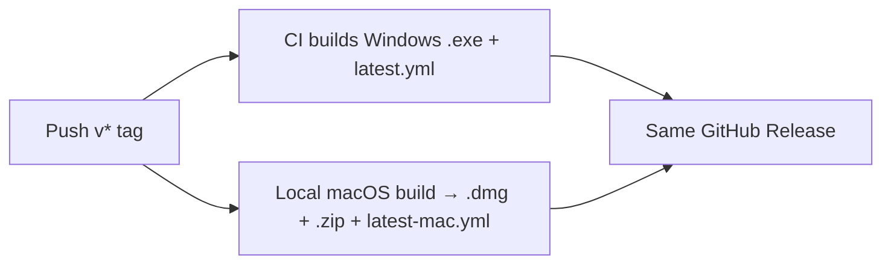
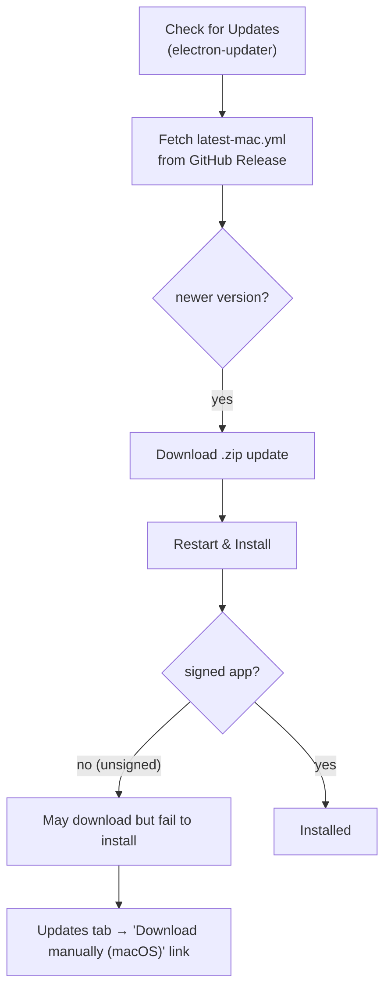

# macOS Build & Release

High-level overview of how the macOS app (`.dmg` / `.zip`) is distributed.

> **Distribution status: unverified by design.** The app is built **unsigned** and
> **not notarized** (no Apple Developer account or signing secrets required).
> Downloaded builds trigger Gatekeeper; users open them via **right-click → Open**
> or **System Settings → Privacy & Security → "Open Anyway"**.

## How it ships

| Platform | Built by | Release assets |
| --- | --- | --- |
| Windows | CI on a `v*` tag | `.exe` installer + `latest.yml` |
| macOS   | locally on a Mac | `.dmg` + `.zip` + `latest-mac.yml` |

**Source:** [`build-win.yml`](../.github/workflows/build-win.yml#L7)

Both platforms are published to the same GitHub Release. The detailed build and
release procedure (commands, architecture targets, pitfalls) is maintained
internally and is not published in this repo.

## Smaller app builds

The packaged app is slimmed at build time — the transcription backend is built
stripped and arch-tuned, and the agent runner is bundled into a single file — so
downloads are significantly smaller and the app starts faster. (Build detail is
maintained internally.)

## In-app auto-update (macOS)

electron-updater on macOS uses the `.zip` + `latest-mac.yml` from the GitHub
Release. Because the app is unsigned, macOS in-app updates are **best-effort** —
the update may download but fail to install. When that happens the Updates tab
shows a **"Download manually (macOS)"** link to the Release as a fallback.

**Source:** [`setupPackagedUpdater()`](../electron/src/main/auto-updater.ts#L485) · [`checkPackagedUpdate()`](../electron/src/main/auto-updater.ts#L534)

## What users must do to open the app

Because the build is unsigned and not notarized, macOS Gatekeeper blocks it after
download. Each user must bypass it once:

1. **Right-click** the app → **Open** → click **Open** in the dialog, **or**
2. **System Settings → Privacy & Security** → under "Security", click **Open Anyway**.

Locally-built DMGs have no quarantine attribute and open without a prompt on the
building machine — the warning only appears after download/distribution.

