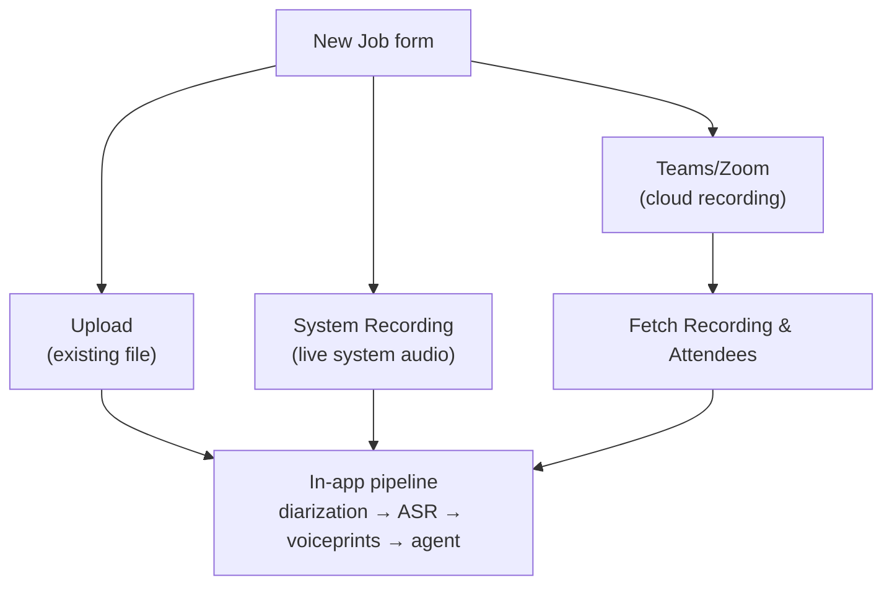
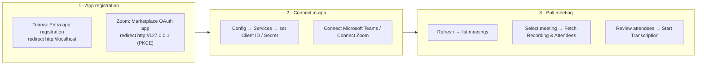

# Meetings Integrations (System Recording, Teams, Zoom)

Setup and usage guide for the three New Job sources added in 0.8.6-2.

## New Job — three sources

The New Job form has three tabs:

| Tab                  | What it does                                                                |
| -------------------- | --------------------------------------------------------------------------- |
| **Upload**           | Existing file upload (unchanged).                                           |
| **System Recording** | Records meeting audio live from system output.                              |
| **Teams/Zoom**       | Pulls a meeting's cloud recording + attendees from Microsoft Teams or Zoom. |

All three submit through the same in-app pipeline (diarization → ASR → voiceprints → agent). Job results show the audio **Source** in the Audio tab.

**Source:** [`NewJobPanel.tsx`](../electron/src/renderer/components/NewJobPanel.tsx#L17) · [`MeetingsPanel.tsx`](../electron/src/renderer/components/MeetingsPanel.tsx#L43)

## System Recording

Records whatever audio your computer is playing (both sides of a meeting). No per-participant audio is exposed by Teams/Zoom, so speaker diarization + voiceprints still assign "who said what".

### Windows

Uses the built-in Windows system-audio capture (WASAPI loopback) — **no driver and no video**. Click **Start Recording**, play your meeting, click **Stop**. The audio is saved as a WebM and fed straight into transcription.

### macOS

macOS has no driver-free system-audio capture, so the free **BlackHole** virtual driver is required:

1. Install [BlackHole](https://github.com/ExistentialAudio/BlackHole) (BlackHole 2ch is fine).
2. Open **Audio MIDI Setup** → **+** → **Create Multi-Output Device**.
3. Add **BlackHole 2ch** and your speakers/headphones to the Multi-Output Device, then set it as the default output. This routes audio to BlackHole (for capture) **and** your speakers (so you can still hear).
4. In the app, the System Recording tab detects BlackHole and captures it with the bundled ffmpeg to an M4A.

#### Capturing your own voice (both sides)

BlackHole is a **loopback** — its input only contains whatever macOS routes to it as an **output**. So a live System Recording automatically captures the **other participants** (Zoom/Teams play them through the system output), but **not your own microphone** unless you loop it back.

**System audio routing:**

| Setting | Value |
| ------- | ----- |
| **Output** | **Multi-Output Device** (BlackHole 2ch + your speakers/headphones) |
| **Input** | **BlackHole 2ch** |

The System Recording tab has a **Capture input (macOS)** dropdown — pick your **Aggregate Device** (BlackHole + your mic) there to record both sides in one stream.

Alternatively, to include your voice, loop your mic back through the meeting app:

| App | Setting |
| --- | ------- |
| **Zoom** | Settings → **Audio** → enable **"Play sound when I speak"** — your mic plays through the output, so BlackHole records you too. |
| **Teams** | No "play my mic back" toggle exists in the standard Teams app. Use the **Teams cloud-recording** flow above (a recording you host includes your mic), or route your mic into BlackHole with a virtual audio router. |

The tab shows setup guidance when BlackHole isn't detected.

## Microsoft Teams

### App registration (Entra ID)

1. Go to the [Microsoft Entra admin center](https://entra.microsoft.com) → **App registrations** → **New registration**.
2. Name it, choose **Accounts in this organizational directory only** (work/school) — Teams cloud recordings require a work/school account.
3. Under **Platform** → **Add a platform** → **Mobile and desktop applications** → redirect URI `http://localhost` (native/public client — **no client secret**).
4. **API permissions** (delegated): `User.Read`, `Calendars.Read`, `OnlineMeetings.Read`, `Files.Read.All`.
5. Copy the **Application (client) ID** into Config → Services → **Teams Client ID**.

### Connecting in the app

1. Config → Services → **Microsoft Teams** accordion → set **Teams Client ID** (use the in-app "How to get these credentials" steps, or set it manually).
2. Click **Connect Microsoft Teams** right in the Services accordion (or in the Teams/Zoom tab) → approve the consent page.
3. **Refresh** to list your online meetings, select one, then **Fetch Recording & Attendees**.
4. Attendees (names + emails) are pre-filled; review, then **Start Transcription**.

> **Redirect URI:** the app's OAuth flow redirects to `http://localhost:<ephemeral port>/`.
> The native/public-client registration of `http://localhost` (above) matches any
> localhost port, so no port needs to be registered for Teams.
>
> **Capturing your own voice:** for a **live** System Recording, Teams has no
> "play my mic back" toggle — use the **cloud-recording** flow above (a recording
> you host includes your mic) or loop your mic into BlackHole with a virtual audio
> router (see [System Recording → macOS](#system-recording)).

## Zoom

### App registration (Zoom Marketplace)

1. [Zoom Marketplace](https://marketplace.zoom.us) → **Build App** → **OAuth** (general purpose).
2. In **Basic Information → App Credentials**, toggle **Use Public Client OAuth** ON and copy the **public client ID** (this is what you enter as the Client ID in the app).
3. Redirect URL for OAuth: `http://127.0.0.1` (numeric loopback — matches any port; only accepted for PKCE public-client flows).
4. Under **Scopes → Add Scopes**, add the granular scopes the app needs (meeting read, recording read, user read). The app omits the `scope` parameter on authorize, so Zoom requests the app's default required scopes automatically.
5. Enter the **public Client ID** (Client Secret optional) into Config → Services.

### Connecting in the app

1. Config → Services → **Zoom** accordion → set **Zoom Client ID** (the public client ID; Client Secret optional) — use the in-app "How to get these credentials" steps, or set them manually.
2. Click **Connect Zoom** right in the Services accordion (or in the Teams/Zoom tab) → approve the consent page.
3. **Refresh** to list meetings with cloud recordings (last 30 days), select one, **Fetch Recording & Attendees**.
4. Note: Zoom often hides participant emails — pre-filled attendees may need emails added manually for voiceprint matching.

> **Redirect URI:** the app's OAuth flow runs PKCE and redirects to `http://127.0.0.1:<ephemeral port>/`.
> Register `http://127.0.0.1` in the Zoom app's OAuth allow list (port-agnostic). If Zoom
> reports "Invalid redirect", also add `http://127.0.0.1/` (the app appends a trailing
> slash). Loopback redirects require PKCE public-client OAuth — do not use `http://localhost`
> (rejected for confidential clients; see the [Zoom OAuth docs](https://developers.zoom.us/docs/integrations/oauth/)).
>
> Also set the primary **OAuth Redirect URL** field (not just the allow list) to
> `http://127.0.0.1` in the **Development** environment — the dashboard's generated
> "OAuth URL" reflects that field and may otherwise keep showing `http://localhost`.
>
> **Capturing your own voice:** for a **live** System Recording, enable **Settings → Audio →
> "Play sound when I speak"** so your mic loops back into BlackHole (see
> [System Recording → macOS](#system-recording)).

## Config keys (Config → Services)

| Key                  | Meaning                                      |
| -------------------- | -------------------------------------------- |
| `MS_CLIENT_ID`       | Teams (Entra) application client ID          |
| `MS_REFRESH_TOKEN`   | Teams refresh token (auto-filled by Connect) |
| `MS_USER`            | Teams signed-in user                         |
| `ZOOM_CLIENT_ID`     | Zoom public client ID (from **Use Public Client OAuth**)     |
| `ZOOM_CLIENT_SECRET` | Zoom client secret (optional — only for confidential clients) |
| `ZOOM_REFRESH_TOKEN` | Zoom refresh token (auto-filled by Connect)  |
| `ZOOM_USER`          | Zoom signed-in user                          |

These are regular config keys, so they participate in config export/import, "save as defaults", and "restore defaults" like every other setting.

**Source:** [`connectTeams()`](../electron/src/renderer/components/ConfigPanel.tsx#L1058) · [`connectZoom()`](../electron/src/renderer/components/ConfigPanel.tsx#L1088) · [`refreshMeetings()`](../electron/src/renderer/components/MeetingsPanel.tsx#L127)
