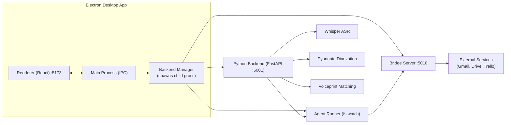
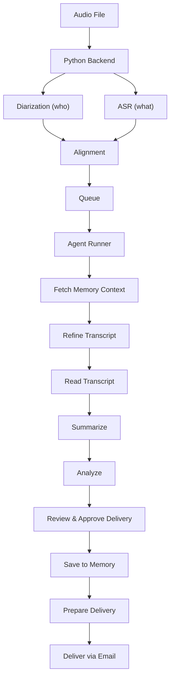

# System Overview

Transcription Agent is a desktop application that transcribes, diarizes, and summarizes meeting audio using AI. It supports speaker identification, action item extraction, semantic memory, and integrates with Gmail, Google Drive, and Trello.

---

## Architecture at a Glance

**Source:** [`backend-manager.ts`](../electron/src/main/backend-manager.ts#L1) · [`startPythonBackend()`](../electron/src/main/backend-manager.ts#L563)

## Core Services

| Service            | Directory         | Port          | Tech               | Purpose                                                                              |
| ------------------ | ----------------- | ------------- | ------------------ | ------------------------------------------------------------------------------------ |
| **Python Backend** | `python-backend/` | `:5001`       | FastAPI + PyTorch  | ML pipeline: ASR, diarization, voiceprints, memory                                   |
| **Bridge Server**  | `bridge-server/`  | `:5010`       | Node.js HTTP       | REST proxy + sanitization + agent config management                                  |
| **Agent Runner**   | `agent-runner/`   | —             | Node.js (fs.watch) | LLM pipeline: claims events from SQLite queue, calls DeepSeek/Ollama, executes tools |
| **Electron App**   | `electron/`       | `:5173` (dev) | React + Vite       | Desktop UI: upload, progress, results, config                                        |

## Data Flow

### Transcription Pipeline

**Source:** [`_run_pipeline_sync()`](../python-backend/services/pipeline.py#L237) · [`enqueue_ready()`](../python-backend/agent_bridge.py#L65) · [`claimPendingEvent()`](../agent-runner/poller.js#L24) · [`processEvent()`](../agent-runner/index.js#L157)

1. **User uploads audio** via the Electron UI
2. **Bridge Server** proxies upload to Python Backend (`:5001`)
3. **Python Backend** runs the ML pipeline:
   - **Diarization** (pyannote/speaker-diarization-3.1) — detects who spoke when
   - **ASR** (Whisper) — transcribes speech to text — platform-optimized variant:
     - macOS Apple Silicon → mlx-whisper (Metal GPU)
     - Windows → faster-whisper (CTranslate2, CUDA)
     - macOS Intel → faster-whisper (CTranslate2)
     - Linux → faster-whisper (CTranslate2)
   - **Voiceprint Matching** — matches speakers to known identities
   - **Alignment** — merges diarization + ASR into speaker-labeled transcript
4. **Agent Bridge** writes an event to the SQLite `events` table and touches `.transcription-trigger`
5. **Agent Runner** (watching via `fs.watch`) claims the event via `POST /queue/claim` and runs the LLM pipeline:
   - Fetch Memory Context
   - Refine (redact PII)
   - Read Transcript
   - Summarize
   - Analyze
   - Review & Approve Delivery
   - Save to Memory
   - Prepare Delivery
6. **Delivery** sends the meeting summary and analysis via email, or optionally to Google Drive / Trello if enabled

## Memory Systems

| Memory Type          | Storage                                | Purpose                                                                                                                                    |
| -------------------- | -------------------------------------- | ------------------------------------------------------------------------------------------------------------------------------------------ |
| **Semantic Memory**  | ChromaDB (`storage/chroma/`)           | Vector search over past meeting transcripts and summaries. Uses `sentence-transformers/all-MiniLM-L6-v2` for local embeddings.             |
| **Ephemeral Memory** | SQLite (`storage/ephemeral_memory.db`) | Structured cross-meeting context: jobs table (metadata, token usage, delivery results), action items, contacts, budgets, decisions, notes. |
| **Voiceprints**      | SQLite (`storage/voiceprints.db`)      | Speaker embedding vectors (512-dim) from pyannote/embedding. Cosine similarity matching with 0.75 threshold.                               |

## Supported Platforms

| Platform            | Whisper Variant | Accelerator         |
| ------------------- | --------------- | ------------------- |
| macOS Apple Silicon | mlx-whisper     | Apple Neural Engine |
| macOS Intel         | faster-whisper  | CPU (CTranslate2)   |
| Windows             | faster-whisper  | CPU / CUDA          |
| Linux               | faster-whisper  | CPU (CTranslate2)   |

## LLM Providers

| Provider                | Type      | Model                        |
| ----------------------- | --------- | ---------------------------- |
| **DeepSeek** (default)  | Cloud API | DeepSeek V4                  |
| **OpenAI**              | Cloud API | GPT-4o (configurable)        |
| **Anthropic**           | Cloud API | Claude Sonnet (configurable) |
| **Ollama**              | Local     | qwen3.6 or deepseekv2        |

## Voiceprint + Attendee Handling

### Voiceprint Enrollment

Voiceprints are speaker embedding vectors (512-dim, extracted by `pyannote/embedding`) stored in a SQLite database at `storage/voiceprints.db`.

**Key design:**

- **Email is the unique upsert key** — `voiceprints` table has `UNIQUE(email)`. When a speaker is re-labeled, their existing embedding is overwritten.
- **`@voiceprint.local` fallback** — if no email is provided, a deterministic placeholder `{slugified_name}@voiceprint.local` is derived, ensuring each named speaker gets a unique key without colliding on empty strings.
- **Three save paths:**
  1. `label_and_resume` (user via SpeakerLabelModal) — extracts **real embedding** from the speaker's longest audio segment
  2. `agent_label_speakers` (LLM in agent pipeline) — extracts real embedding if audio is available
  3. `transcribe_label_speaker` tool (agent bridge) — same as #2
- **Conflict dialog** — before overwriting an existing voiceprint, the SpeakerLabelModal checks `POST /voiceprints/check-conflicts` and asks the user to confirm.

### Attendee Registration

Attendees are stored in the `ephemeral_memory.db — attendees` table. Registration happens **only after full attendee reconciliation** (never during upload):

1. Upload stores attendee names in `metadata.json` only
2. Pipeline runs diarization → voiceprint matching
3. `_reconcile_attendees()` computes:
   - **Matched speakers** — attendees whose voice matched a known voiceprint
   - **Non-speaking attendees** — registered attendees never detected as speakers
   - **Unknown speakers** — detected voices matched to no attendee
4. After reconciliation, all attendees (speaking + non-speaking) are registered in the ephemeral DB

### Non-Speaking Attendees

Registered attendees who did not speak are:

- Displayed in the SpeakerLabelModal under "Also present but did not speak"
- Passed to the LLM via `{{non_speaking_attendees}}` in the pipeline prompt template
- Included in delivery records

Users can **exclude** a non-speaking attendee from the meeting record and delivery in two ways: resolving a voice-match conflict toward "use voice owner" (the losing form entry is auto-excluded) or clicking the **X** button next to the attendee in the modal. Excluded names are sent as `excluded_non_speaking` with the speaker-labeling request and dropped from the reconciled attendee list, `metadata.json`, and `email_recipients` in both the post-ASR and pre-ASR/resumed labeling paths.

### Server-Side Conflict Check

Before manually adding an attendee in the UploadPanel, a `POST /attendees/check-conflicts` call checks:

- Does this email already exist under a different name?
- Does this name already exist with a different email?
- Does a voiceprint already exist for this name or email?

Conflicts are shown as inline errors; the add is blocked until resolved.

## Key Design Decisions

- **SQLite-backed event queue** instead of a message broker — the agent bridge writes events to the `events` table in `ephemeral_memory.db` (SQLite) and touches a trigger file. The agent runner claims events via HTTP. No Kafka/RabbitMQ dependency.
- **Bridge pattern** — the agent runner calls tools via the bridge server (HTTP), which proxies to Python or executes directly. This keeps the Python backend isolated and the agent runner pure Node.js.
- **Sanitization tiers** — Tier 1 (mandatory) redacts API keys and secrets from all bridge responses. Tier 2 (optional) sanitizes transcript content.
- **Pipeline steps are configurable** — the agent config (`agent-config/pipeline.json`) defines order, enabled state, and hints. Users can toggle steps via the ConfigPanel without touching code.
- **Attendee registration after reconciliation** — attendees are persisted to the ephemeral DB only after voiceprint matching determines who spoke and who didn't, preventing incomplete or speculative attendee records.
- **Self-updating** — dev mode uses git pull; packaged mode uses electron-updater with GitHub Releases.
