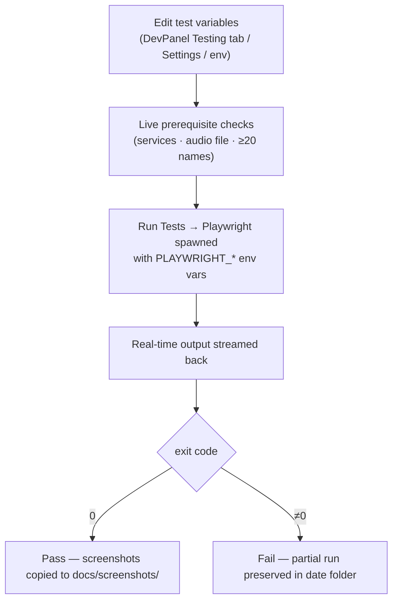
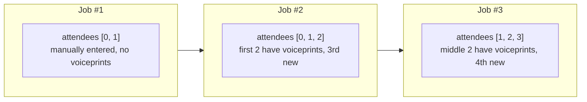

# Testing Checklist

This document covers manual and automated testing for the Transcription Agent.

---

## Automated Tests

### Playwright E2E Screenshot Tests

```bash
cd electron

# Run all screenshot tests (headless)
npm test

# Run with visible browser
npm run test:headed

# Run only screenshot tests
npm run screenshots        # headed
npm run screenshots:headless
```

Test file: `electron/tests/screenshots/user-guide-screenshots.spec.ts`

### Test Variables

The screenshot test reads three key variables that can be configured:

| Variable        | Env Var                      | Config Key                   | Default                                 |
| --------------- | ---------------------------- | ---------------------------- | --------------------------------------- |
| Audio file path | `PLAYWRIGHT_AUDIO_FILE_PATH` | `PLAYWRIGHT_AUDIO_FILE_PATH` | `/Users/.../Downloads/test-meeting.mp3` |
| Title template  | `PLAYWRIGHT_TITLE_TEMPLATE`  | `PLAYWRIGHT_TITLE_TEMPLATE`  | `test {autoNum}`                        |
| Generic names   | `PLAYWRIGHT_GENERIC_NAMES`   | `PLAYWRIGHT_GENERIC_NAMES`   | 20-name list (comma-sep)                |

> **Speaker labeling:** Each detected speaker gets a unique name from the configurable
> 20-name list (default: Alex, Blake, Casey, Drew, Ellis, Finley, Gray, Harper, Indigo,
> Jade, Kai, Logan, Morgan, Nico, Oakley, Parker, Quinn, Reese, Skyler, Taylor). Names
> are editable in the DevPanel Testing tab via a textarea — must contain at least 20.

These can be set in three ways:

1. **DevPanel Testing tab** — edit and run from the UI
2. **Settings → Testing section** — persist in config.json
3. **Environment variables** — set before running `npx playwright test`

> **Note:** Playwright screenshot tests are a **dev-only feature**. When the app is packaged (installed via NSIS/DMG), the Testing tab is disabled with a banner explaining that tests must be run from the project directory via `npm run test`. This is because Playwright, its browser binaries, and the test source files are not bundled with the distributed app.

### Screenshot Output Locations

Screenshots are written to a **timestamped subdirectory** under `docs/screenshots/YYYY-MM-DD/` and then **copied** to `docs/screenshots/` (root) after all tests complete. This means:

- The user guide markdown links (e.g. ``) always show the latest run
- Prior runs are preserved in their date-stamped folders for comparison
- Partial runs (e.g. if a test fails mid-way) will not overwrite the root copies until `afterAll` completes



**Source:** [`user-guide-screenshots.spec.ts`](../electron/tests/screenshots/user-guide-screenshots.spec.ts#L1)

### TypeScript Compilation

```bash
cd electron
npm run build          # Full build (renderer + main)
npm run build:main     # Main process only
```

### Python Backend

```bash
cd python-backend
source venv/bin/activate
python -c "from main import app; print('FastAPI app loaded OK')"
```

---

## Manual Testing Checklist

### 1. Setup & Configuration

| #   | Test Case                                        | Expected Result                                                      | Pass/Fail |
| --- | ------------------------------------------------ | -------------------------------------------------------------------- | --------- |
| 1.1 | Run `npm run transcribe:setup` on a clean system | venv created, deps installed, Whisper variant detected and installed |           |
| 1.2 | Open ConfigPanel, enter DeepSeek API key         | Key saved, "Check Config" shows OK                                   |           |
| 1.3 | Toggle LLM Provider between DeepSeek and Ollama  | Radio buttons switch, relevant fields show/hide                      |           |
| 1.4 | Configure GITHUB_TOKEN for private repo updates  | Token saved, visible in config                                       |           |
| 1.5 | Export config to JSON file                       | File downloads with all values (secrets masked)                      |           |
| 1.6 | Import config from JSON file                     | Values restored, agent config also imported if present               |           |
| 1.7 | Restore default agent config                     | tools.json, pipeline.json, system-prompt.md reset to defaults        |           |

### 2. Service Health & Status Bar

| #   | Test Case                                                   | Expected Result                                              | Pass/Fail |
| --- | ----------------------------------------------------------- | ------------------------------------------------------------ | --------- |
| 2.1 | Start all services with `npm run transcribe:all`            | Python (:5001), Bridge (:5010), Agent all running            |           |
| 2.2 | Check StatusBar shows green indicators for all services     | Three green dots: Python, Bridge, Agent                      |           |
| 2.3 | Stop the Python backend manually                            | StatusBar shows Python as red, "Backend Down" banner appears |           |
| 2.4 | Restart the Python backend from StatusBar                   | Python returns to green                                      |           |
| 2.5 | Check "Check Servers" button re-checks all services at once | All three indicators update                                  |           |
| 2.6 | Server Status Banner shows per-service rows                 | Python, Bridge, Agent with individual icons and restart btns |           |

### 3. Audio Upload

| #   | Test Case                                        | Expected Result                                 | Pass/Fail |
| --- | ------------------------------------------------ | ----------------------------------------------- | --------- |
| 3.1 | Upload a WAV file via file picker                | Job created, progress starts                    |           |
| 3.2 | Upload an MP3 file via drag-and-drop             | File accepted, standardized to WAV              |           |
| 3.3 | Upload an unsupported file type (.pdf)           | Error message: "Unsupported format"             |           |
| 3.4 | Upload a file >500MB                             | Error message: "File too large"                 |           |
| 3.5 | Enter meeting title and attendees                | Metadata saved with job                         |           |
| 3.6 | Toggle skip steps (Skip analysis, Skip delivery) | Pipeline skips those steps                      |           |
| 3.7 | Upload a second file while first is processing   | Error: "A transcription job is already running" |           |
| 3.8 | Upload from history with "New Job" button        | Form pre-filled with attendee suggestions       |           |

### 4. ML Pipeline (Diarization + ASR)

| #    | Test Case                                                        | Expected Result                                                                 | Pass/Fail |
| ---- | ---------------------------------------------------------------- | ------------------------------------------------------------------------------- | --------- |
| 4.1  | ProgressPanel shows correct stage for each pipeline step         | Steps light up in order: Uploading → Getting Ready → Identifying Speakers → ... |           |
| 4.2  | Speaker diarization completes for a 2-speaker recording          | Two speakers detected (SPEAKER_00, SPEAKER_01)                                  |           |
| 4.3  | Speaker diarization completes for a 4-speaker recording          | Four speakers detected                                                          |           |
| 4.4  | ASR transcription produces text for clear audio                  | All words accurately transcribed                                                |           |
| 4.5  | Alignment merges diarization + ASR correctly                     | Speaker-labeled transcript with accurate timestamps                             |           |
| 4.6  | Pipeline pauses for labeling when speaker count ≠ attendee count | SpeakerLabelModal appears with audio clips                                      |           |
| 4.7  | Label all speakers in the modal and confirm                      | Pipeline resumes, voiceprint saved with real embedding                          |           |
| 4.8  | Skip labeling (use default names)                                | Pipeline resumes with SPEAKER_00, SPEAKER_01 names                              |           |
| 4.9  | Cancel during labeling                                           | Pipeline cancelled, job status = "cancelled"                                    |           |
| 4.10 | Process a very long meeting (>1 hour)                            | Pipeline completes within 30-minute timeout                                     |           |

### 5. LLM Pipeline (Agent Runner)

| #   | Test Case                                        | Expected Result                                       | Pass/Fail |
| --- | ------------------------------------------------ | ----------------------------------------------------- | --------- |
| 5.1 | Refine step removes filler words (um, uh, like)  | Transcript cleaned                                    |           |
| 5.2 | Refine step redacts PII (emails, phone numbers)  | PII replaced with [REDACTED]                          |           |
| 5.3 | Summary step generates executive summary         | Summary tab shows coherent summary                    |           |
| 5.4 | Summary step extracts key decisions              | Key decisions list is populated                       |           |
| 5.5 | Summary step extracts action items               | Action items with assignees and deadlines             |           |
| 5.6 | Analysis step extracts topics                    | Topics list is populated                              |           |
| 5.7 | Analysis step extracts sentiment                 | Sentiment score displayed                             |           |
| 5.8 | Pipeline respects skip_steps from upload form    | Skipped tools not called, skipped stages marked in UI |           |
| 5.9 | Memory context is fetched for recurring meetings | Past action items referenced in summary               |           |

### 6. Results Viewer

| #    | Test Case                                      | Expected Result                                         | Pass/Fail |
| ---- | ---------------------------------------------- | ------------------------------------------------------- | --------- |
| 6.1  | Transcript tab shows speaker-labeled segments  | Color-coded speaker labels, timestamps, text            |           |
| 6.2  | Summary tab shows executive summary            | Collapsible sections for decisions, discussion, actions |           |
| 6.3  | Analysis tab shows topics, sentiment, entities | All analysis fields populated                           |           |
| 6.4  | Audio tab plays the original recording         | Audio player with seek controls                         |           |
| 6.5  | Pipeline tab shows progress for completed jobs | Progress bar at 100%, stage checkmarks                  |           |
| 6.6  | Tokens tab shows LLM token usage               | Per-step breakdown with totals                          |           |
| 6.7  | Logs tab shows job-specific log files          | pipeline.log content displayed                          |           |
| 6.8  | Logs tab collapses repeated consecutive lines  | Expandable groups with line count badge                 |           |
| 6.9  | Attendees tab shows registered attendees       | Name, email, voiceprint status, sample availability     |           |
| 6.10 | Click a history job, results load correctly    | All tabs populated from stored data                     |           |

### 7. Memory

| #   | Test Case                                                           | Expected Result                                           | Pass/Fail |
| --- | ------------------------------------------------------------------- | --------------------------------------------------------- | --------- |
| 7.1 | Semantic memory stores meeting summary after pipeline               | ChromaDB contains entry for job                           |           |
| 7.2 | Search memory for past meeting topic                                | Matching meetings returned with relevance scores          |           |
| 7.3 | Ephemeral memory stores action items                                | Query action_items table returns entries                  |           |
| 7.4 | Ephemeral memory stores budgets, decisions, contacts                | Each table populated correctly                            |           |
| 7.5 | Voiceprint successfully matched on second meeting with same speaker | Speaker auto-identified without labeling                  |           |
| 7.6 | Job record persisted to ephemeral DB on upload                      | `query_jobs()` returns entry with title and status        |           |
| 7.7 | LLM token usage upserted mid-pipeline                               | `get_job()` shows cumulative token counts after each step |           |
| 7.8 | Delivery results persisted to jobs table                            | `get_job()` shows delivery results and completion time    |           |

### 8. History & Storage

| #   | Test Case                                                      | Expected Result                               | Pass/Fail |
| --- | -------------------------------------------------------------- | --------------------------------------------- | --------- |
| 8.1 | History panel lists all past jobs                              | Sorted by date, status shown                  |           |
| 8.2 | Click a history job                                            | Job loads in ResultsViewer                    |           |
| 8.3 | Storage panel shows disk usage for logs, history, chroma, etc. | Accurate byte counts and human-readable sizes |           |
| 8.4 | Delete job from history                                        | Job directory removed from storage            |           |

### 9. Appearance

| #   | Test Case                                      | Expected Result                          | Pass/Fail |
| --- | ---------------------------------------------- | ---------------------------------------- | --------- |
| 9.1 | Toggle between dark and light themes           | All UI components update correctly       |           |
| 9.2 | Change font size (small, medium, large)        | All text scales proportionally           |           |
| 9.3 | Change accent color                            | Buttons, links, highlights use new color |           |
| 9.4 | Appearance settings persist across app restart | Settings loaded from config.json         |           |

### 10. DevPanel

| #     | Test Case                                    | Expected Result                             | Pass/Fail |
| ----- | -------------------------------------------- | ------------------------------------------- | --------- |
| 10.1  | Live Logs show entries from all services     | Python, Bridge, Agent, Main logs visible    |           |
| 10.2  | Filter by source (Python only)               | Only Python entries shown                   |           |
| 10.3  | Filter by level (errors only)                | Only error entries shown                    |           |
| 10.4  | Text search highlights matching entries      | Matches highlighted with background color   |           |
| 10.5  | Auto-scroll follows new entries              | List scrolls to bottom automatically        |           |
| 10.6  | Log filters persist across sessions          | After refresh, same filters applied         |           |
| 10.7  | Performance tab shows CPU/memory charts      | Charts render with real data                |           |
| 10.8  | Usage tab shows credit balance / no-usage badge  | DeepSeek balance shown; OpenAI/Anthropic show "usage can't be tracked" |           |
| 10.9  | Usage tab shows aggregate token usage            | Per-job breakdown with provider/model columns and totals  |           |
| 10.10 | Log Files tab lists on-disk log files        | Primary and job log files visible           |           |
| 10.11 | Testing tab shows test variables from config | Fields pre-filled with config.json values   |           |
| 10.12 | Edit a test variable and click Run Tests     | Variables saved, Playwright spawns, output  |           |
| 10.13 | Run Tests shows real-time output             | Output streams in as tests execute          |           |
| 10.14 | Test exit code shown (pass/fail)             | Green "Passed" or red "Failed" with code    |           |

### 11. Updates

| #    | Test Case                                                               | Expected Result                        | Pass/Fail |
| ---- | ----------------------------------------------------------------------- | -------------------------------------- | --------- |
| 11.1 | Dev mode: "Check for Updates" button                                    | Git fetch runs, checks for new commits |           |
| 11.2 | Dev mode: Updates available notification                                | Shows commit count behind              |           |
| 11.3 | Packaged mode: "Check for Updates" button                               | Checks GitHub Releases for new version |           |
| 11.4 | Packaged mode: "Download Update" (when available)                       | Downloads with progress bar            |           |
| 11.5 | Packaged mode: "Restart & Install" (when downloaded)                    | App restarts with new version          |           |
| 11.6 | Toggle "Auto-check periodically"                                        | Auto-check interval starts/stops       |           |
| 11.7 | Status banner shows correct state (Up to date / Available / Downloaded) | Color-coded banner with icon           |           |
| 11.8 | Error state shows failure message                                       | Red banner with error details          |           |

### 12. Delivery

| #    | Test Case                                  | Expected Result                          | Pass/Fail |
| ---- | ------------------------------------------ | ---------------------------------------- | --------- |
| 12.1 | Configure Gmail credentials in ConfigPanel | Credentials saved                        |           |
| 12.2 | Enable email delivery in pipeline steps    | Email delivery step runs                 |           |
| 12.3 | Verify email is sent with meeting summary  | Email received with transcript + summary |           |
| 12.4 | Configure Google Drive destination folder  | Transcript saved to Drive                |           |
| 12.5 | Configure Trello integration               | Action items created as Trello cards     |           |

### 13. Error Handling

| #    | Test Case                             | Expected Result                                      | Pass/Fail |
| ---- | ------------------------------------- | ---------------------------------------------------- | --------- |
| 13.1 | Upload when backend is down           | Error message: "Bridge unreachable"                  |           |
| 13.2 | Process with no API key configured    | ConfigPanel shows missing fields, StatusBar warns    |           |
| 13.3 | Network failure during model download | Retry with local_files_only=True                     |           |
| 13.4 | Agent runner crashes mid-pipeline     | Job marked as "failed" after timeout                 |           |
| 13.5 | Backend restart while polling         | Polling pauses, resumes when backend returns         |           |
| 13.6 | Corrupt status.json                   | Backend returns "corrupted" status gracefully        |           |
| 13.7 | Unauthorized Hugging Face token       | Diarization fails with clear error about gated model |           |

---

## Automated Test Bot

A Node.js test bot script at `scripts/test-bot.mjs` can run 3 sequential transcription jobs
through the same backend API that the UI uses. It is accessible via **DevPanel → Testing → Backend**
sub-tab where the script can be edited, saved, and run.

### Configuration

Edit the `CONFIG` block at the top of `scripts/test-bot.mjs`:

| Field            | Description                                                      |
| ---------------- | ---------------------------------------------------------------- |
| `audioPath`      | Absolute path to the audio file (same file used for all 3 jobs)  |
| `baseJobName`    | Base job name — auto-incremented with `#1`, `#2`, `#3`           |
| `attendeeList`   | Array of `{name, email}` objects — the pool used across all jobs |
| `bridgeUrl`      | Bridge server URL (default: `http://127.0.0.1:5010`)             |
| `pollIntervalMs` | Status polling interval in ms (default: 3000)                    |

### Attendee Progression (Sliding Window)

Given N attendees in `attendeeList`:

| Job | Attendees   | Notes                                            |
| --- | ----------- | ------------------------------------------------ |
| #1  | `[0, 1]`    | First 2 — manually entered, no prior voiceprints |
| #2  | `[0, 1, 2]` | First 2 now have voiceprints, 3rd is new         |
| #3  | `[1, 2, 3]` | Middle 2 have voiceprints, 4th is new            |



**Source:** [`scripts/test-bot.mjs`](../scripts/test-bot.mjs#L1)

### Test Log

Each run appends a JSONL entry to `storage/test-bot-log.jsonl`:

```jsonl
{
  "testId": "uuid",
  "timestamp": "ISO-8601",
  "jobIds": [
    "id1",
    "id2",
    "id3"
  ]
}
```

View past runs in **DevPanel → Testing → Logs → Backend Test Logs**.

### Running

**From the UI:**

1. Open DevPanel → Testing → Backend
2. Edit the `CONFIG` block in the script editor
3. Click **Save**, then **Run**
4. Watch live output in the Output panel
5. Job IDs appear as they're created (one per line)

**From the terminal:**

```bash
node scripts/test-bot.mjs
```

### Behavior

- **No data clearing** — jobs are created fresh each run
- **Auto-labeling** — if the pipeline pauses for speaker labeling, the bot fetches speaker clips and assigns names from `attendeeList` automatically
- **Failure resilience** — if a job fails, the bot logs a warning and continues to the next job
- **Frontend visibility** — jobs appear in the HistoryPanel and ProgressPanel in real-time through normal polling
