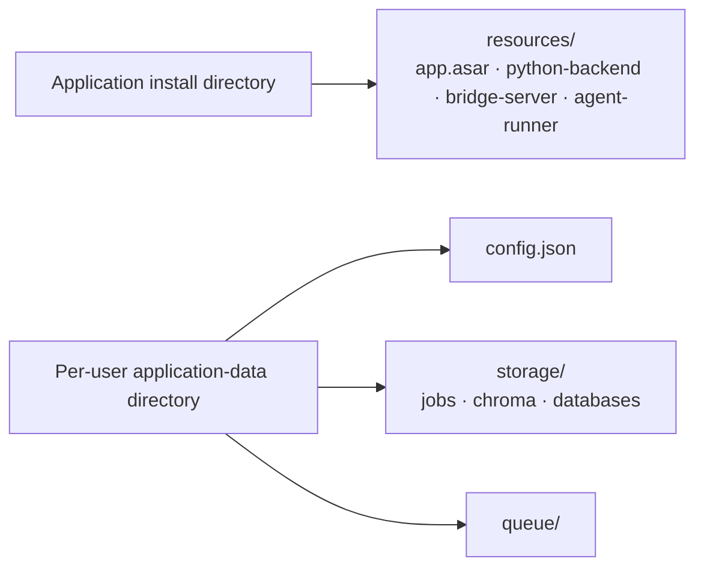

# File Locations (Windows & macOS)

Where the Transcription Agent stores files on Windows and macOS.

## Application Install

### Windows

Installed to `Program Files` (`perMachine: true` in NSIS config):

```
C:\Program Files\Transcription Agent\
```

| Path                                | Contents                                |
| ----------------------------------- | --------------------------------------- |
| `Transcription Agent.exe`           | Electron app launcher                   |
| `resources\app.asar`                | Packaged Electron app (main + renderer) |
| `resources\python-backend\`         | PyInstaller-built Python backend        |
| `resources\bridge-server\`          | Node.js bridge server                   |
| `resources\agent-runner\`           | Node.js agent runner                    |
| `Uninstall Transcription Agent.exe` | NSIS uninstaller                        |

### macOS

Installed to `/Applications` (drag the `.app` from the DMG):

```
/Applications/Transcription Agent.app/
```

| Path                                        | Contents                                   |
| ------------------------------------------- | ------------------------------------------ |
| `Contents/MacOS/Transcription Agent`        | Electron app launcher                      |
| `Contents/Resources/app.asar`               | Packaged Electron app (main + renderer)    |
| `Contents/Resources/python-backend/`        | PyInstaller-built Python backend           |
| `Contents/Resources/bridge-server/`         | Node.js bridge server                      |
| `Contents/Resources/agent-runner/`          | Node.js agent runner                       |
| `Contents/Resources/ffmpeg/ffmpeg`          | Bundled ffmpeg binary                      |

> The macOS build is distributed **unsigned/not notarized** — after download, open it
> once via **right-click → Open** or **System Settings → Privacy & Security → "Open Anyway"**.

## User Data

> Exact per-user paths are intentionally not published. User data (config,
> storage, logs, models) is stored under the platform's standard per-user
> application-data directory, resolved at runtime by the app.

### Windows

Stored under the platform's standard per-user application-data directory
(resolved at runtime by the app). The following **relative** contents live there:

| Path                          | Contents                                                      |
| ----------------------------- | ------------------------------------------------------------- |
| `config.json`                 | UI-saved configuration values                                 |
| `storage\`                    | All job data (transcripts, audio, status, embeddings)         |
| `storage\<job_id>\`           | Per-job directory (status.json, transcript.json, audio, logs) |
| `storage\chroma\`             | ChromaDB vector store (semantic memory)                       |
| `storage\ephemeral_memory.db` | SQLite DB (action items, contacts, budgets, decisions)        |
| `storage\voiceprints.db`      | SQLite DB (enrolled speaker voiceprints)                      |
| `storage\logs\`               | Agent runner JSONL logs                                       |
| `storage\uploads\`            | Temp upload directory (cleaned after processing)              |
| `storage\test-bot-log.jsonl`  | Test bot run logs                                             |
| `logs\`                       | Electron main + per-service logs (`startup-error.log`, `agent.log`, `bridge.log`, `update.log`); Windows NSIS installs also write `installer.log` here |
| `queue\`                      | Pipeline job queue files                                      |
| `bin\ffmpeg.exe`              | Auto-downloaded ffmpeg binary                                 |
| `.ollama-auto-installed`      | Sentinel (Ollama was auto-installed)                          |
| `.ffmpeg-auto-installed`      | Sentinel (ffmpeg was auto-installed)                          |

### macOS

Stored under the platform's standard per-user application-data directory
(resolved at runtime by the app). The following **relative** contents live there:

| Path                          | Contents                                                      |
| ----------------------------- | ------------------------------------------------------------- |
| `config.json`                 | UI-saved configuration values                                 |
| `ui-state.json`               | Persisted UI preferences (tabs, selections, form drafts)      |
| `agent-config/`               | Agent instructions (live `pipeline.json` / `tools.json` / `system-prompt.md` + `.defaults/`) |
| `storage/`                    | All job data (transcripts, audio, status, embeddings)         |
| `storage/<job_id>/`           | Per-job directory (status.json, transcript.json, audio, logs) |
| `storage/chroma/`             | ChromaDB vector store (semantic memory)                       |
| `storage/ephemeral_memory.db` | SQLite DB (action items, contacts, budgets, decisions)        |
| `storage/voiceprints.db`      | SQLite DB (enrolled speaker voiceprints)                      |
| `storage/logs/`               | Agent runner JSONL logs                                       |
| `storage/uploads/`            | Temp upload directory (cleaned after processing)              |
| `logs/`                       | Electron main + per-service logs (`startup-error.log`, `agent.log`, `bridge.log`, `update.log`); no installer log on macOS (DMG drag-copy) |
| `meetings/`                   | Downloaded Teams/Zoom recordings (`teams/` / `zoom/`)         |
| `queue/`                      | Pipeline job queue files                                      |
| `bin/ffmpeg`                  | Auto-downloaded ffmpeg binary                                 |
| `.ollama-auto-installed`      | Sentinel (Ollama was auto-installed)                          |
| `.ffmpeg-auto-installed`      | Sentinel (ffmpeg was auto-installed)                          |

## Ollama (if auto-installed)

### Windows / macOS

Ollama is auto-installed to the platform's standard application locations
when it is required and not already present.

## Manual Deletion

### Windows / macOS

- **Windows:** uninstall via **Settings → Apps → Installed apps** (the NSIS uninstaller) or the
  dedicated **Uninstall** entry. A checkbox on the uninstall page controls whether your user data is
  deleted — untick it to keep your data.
- **macOS:** drag **Transcription Agent.app** from **Applications** to the **Trash**. This removes the
  app but leaves user data in the platform's standard per-user application-data directory — delete that
  folder manually for a full removal.

> Exact install/user-data paths are intentionally not published here; see the in-app uninstall flow for
> details.

## Layout at a glance



**Source:** [`getChildEnv()`](../electron/src/main/config.ts#L832)
