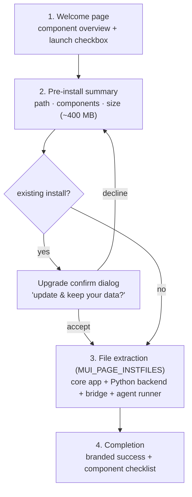
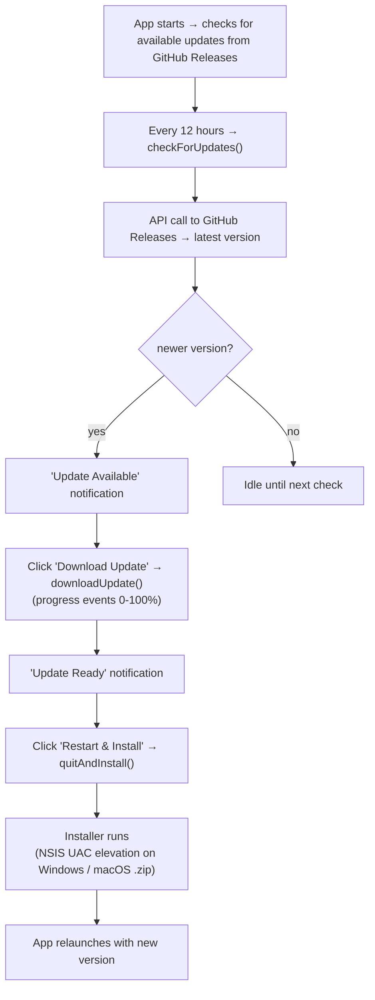
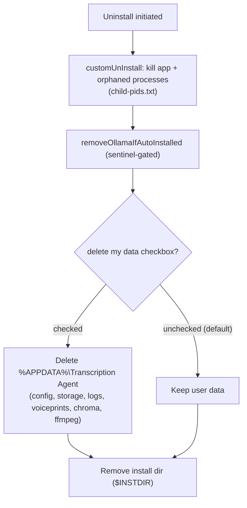

# Install, Uninstall & Update (Windows & macOS)

This document covers installer behavior, the update mechanism, and uninstallation for both Windows and macOS.

---

## Installer

Windows uses an **NSIS** installer; macOS uses a **DMG** (which contains the `.app`), both built by electron-builder. The macOS build is **unsigned/not notarized** — users open it once via **right-click → Open** or **System Settings → Privacy & Security → "Open Anyway"**.

### Build

```bash
cd electron
npm run dist:win   # Windows → electron/dist/Transcription-Agent-<version>-<arch>.exe
npm run dist:mac   # macOS   → electron/dist/Transcription-Agent-<version>-<arch>.dmg + .zip (host arch only)
```

Outputs:
- Windows: `electron/dist/Transcription-Agent-<version>-<arch>.exe`
- macOS: `electron/dist/Transcription-Agent-<version>-<arch>.dmg` + `.zip`

For distribution, Windows is built by CI (`.github/workflows/build-win.yml`) on a `v*` tag; macOS is built locally (`electron-builder --mac --publish always`) and both are published to the same GitHub Release.

### Windows (NSIS)

The Windows distribution uses an NSIS installer built by electron-builder.

### Installer Configuration (`electron/package.json`)

```json
"win": {
  "target": "nsis",
  "nsis": {
    "oneClick": false,
    "allowToChangeInstallationDirectory": false,
    "deleteAppDataOnUninstall": false,
    "perMachine": true,
    "runAfterFinish": true,
    "include": "build/installer.nsh"
  }
}
```

| Setting                    | Value                 | Effect                                               |
| -------------------------- | --------------------- | ---------------------------------------------------- |
| `oneClick`                 | `false`               | Multi-page installer with welcome page (not silent)  |
| `perMachine`               | `true`                | Installs to `Program Files`, requires admin          |
| `deleteAppDataOnUninstall` | `false`               | Data removal is controlled by the uninstall-page checkbox (default **unchecked** — data kept unless opted in). Silent `/S` keeps data unless `--delete-app-data` |
| `runAfterFinish`           | `true`                | Launches app after installation completes            |
| `include`                  | `build/installer.nsh` | Custom branding, progress page, upgrade confirm, cancel-enabled extraction |

### Installer Flow

1. **Welcome page** (custom NSIS) — shows app name, component overview:
   - 🐍 Python Backend — whisper ASR + speaker diarization
   - ⚡ Node.js Runtime — via Electron (embedded)
   - 🌉 Bridge Server
   - 🤖 Agent Runner
   - Checkbox: "Launch Transcription Agent after installation" (checked by default)
2. **Pre-install summary page** (custom NSIS via `customPageAfterChangeDir`) — shows:
   - Install path (`$INSTDIR`)
   - Component checklist
   - Total size (~400 MB)
   - "Click Install to begin" prompt
3. **Upgrade confirm** — if an existing installation is detected, a confirmation
   dialog ("Transcription Agent is already installed — update & keep your data?")
   appears before extraction. Declining returns to the summary page.
4. **File extraction** (`MUI_PAGE_INSTFILES`) — electron-builder extracts:
   - Core app files (`dist/`)
   - Extra resources: Python backend, bridge server, agent runner
   - **Details view** is shown by default (`ShowInstDetails show`)
   - **Cancel button** remains enabled throughout extraction — users can abort mid-installation
5. **Completion** — branded success message with component checklist



**Source:** [`customWelcomePage`](../electron/build/installer.nsh#L87) · [`customPageAfterChangeDir`](../electron/build/installer.nsh#L135) · [`instProgressLeave`](../electron/build/installer.nsh#L178)

### Bundled Components

The installer bundles everything needed:

| Component       | Source                           | Size                        |
| --------------- | -------------------------------- | --------------------------- |
| Electron app    | `electron/dist/`                 | ~50 MB                      |
| Python backend  | `dist-resources/python-backend/` | ~200 MB (standalone binary) |
| Node.js runtime | Electron (embedded) | 0 MB |
| Bridge server   | `bridge-server/` (source)        | ~5 MB                       |
| Agent runner    | `agent-runner/dist/` (bundled)   | ~2 MB                       |
| **Total**       |                                  | **~400 MB**                 |

### Custom NSIS Macros (`electron/build/installer.nsh`)

| Macro                      | electron-builder hook   | Purpose                                                             |
| -------------------------- | ----------------------- | ------------------------------------------------------------------- |
| `customWelcomePage`        | `assistedInstaller.nsh` | Branded welcome page with component overview + launch checkbox      |
| `customPageAfterChangeDir` | `assistedInstaller.nsh` | Pre-install summary page showing install path, components, and size |
| `instProgressLeave`        | NSIS page leave callback| Upgrade/overwrite confirm when an existing install is detected       |
| `instfiles.pre`            | MUI instfiles custom pre | Re-enables Cancel button before extraction starts                   |
| `instfiles.show`           | MUI instfiles custom show| Keeps Cancel button enabled while extraction page is visible        |

**Key behaviors:**

- **Cancel is always enabled** — wired through MUI2's
  `MUI_PAGE_CUSTOMFUNCTION_PRE` / `MUI_PAGE_CUSTOMFUNCTION_SHOW` defines. MUI2 does
  not resolve `instfiles.pre` / `instfiles.show` by name — it declares the
  instfiles page with `PageEx instfiles` + `PageCallbacks` bound to its own
  `mui.InstFilesPre/Show` functions, so plain functions named `instfiles.pre` /
  `instfiles.show` would never be called (and trigger NSIS warning 6010). Both
  call `GetDlgItem $0 $HWNDPARENT 2` + `EnableWindow $0 1` to override NSIS's
  default behavior of disabling Cancel during extraction. Aborting mid-extraction
  leaves a partial install — re-running the installer repairs it. These two
  callbacks are wrapped in `!ifndef BUILD_UNINSTALLER`: electron-builder injects
  this include into the shared header compiled for BOTH the installer and the
  intermediate uninstaller build (makensis runs with `-WX`, warnings-as-errors), and
  the uninstaller has no `instfiles` page — leaving them unguarded triggers NSIS
  warning 6010 ("function not referenced") and fails the build.
- **Upgrade/overwrite confirm** — `instProgressLeave` checks for an existing
  install and prompts before extraction; declining returns to the summary page.
- **Details view shown by default** — `ShowInstDetails show` makes the extraction log visible without requiring the user to expand it
- All DetailPrint messages (component progress, start/complete banners) remain and display in the instfiles details view

### macOS (DMG)

The macOS distribution is a DMG built by electron-builder (`build.mac` targets `dmg` + `zip`). It contains the `Transcription Agent.app` bundle:

1. Mount the DMG (double-click).
2. Drag **Transcription Agent** into **Applications**.
3. First launch (unsigned build): **right-click → Open** → **Open**, or **System Settings → Privacy & Security → "Open Anyway"**.

The `.zip` is the auto-update artifact (the `.app` compressed) consumed by electron-updater via `latest-mac.yml` — it is not a user-facing installer.

---

## Update Mechanism

### How It Works

Updates use `electron-updater` with GitHub Releases as the source.

### Configuration

```json
"publish": {
  "provider": "github",
  "owner": "afrogenesurvive",
  "repo": "ai_transcription_agent",
  "private": true,
  "releaseType": "release"
}
```

> **Private repo:** updates are served from GitHub Releases for the project; update checks use the
> app's configured access token.

### Update Flow (Packaged Mode)



**Source:** [`setupPackagedUpdater()`](../electron/src/main/auto-updater.ts#L485) · [`checkAndUpdate()`](../electron/src/main/auto-updater.ts#L597)

### Key Details

| Aspect             | Detail                                                                 |
| ------------------ | ---------------------------------------------------------------------- |
| **Check interval** | Every 12 hours (both packaged and dev)                                 |
| **Auto-download**  | `false` — user must initiate download manually                         |
| **Pre-releases**   | `false` — only stable releases                                         |
| **Auth**           | Update checks are made against the GitHub Releases API using the app's configured access token |
| **Elevation**      | Non-silent install on Windows — UAC prompt appears for admin elevation |
|                    | (per-machine install in `Program Files`). Silent on macOS/Linux.       |
| **Source**         | GitHub Releases (`afrogenesurvive/ai_transcription_agent`)             |
| **Rollback**       | Not automatic — reinstall previous version manually                    |

> **macOS update:** on macOS electron-updater uses the `.zip` artifact + `latest-mac.yml`
> from the GitHub Release. Because the build is unsigned, updates are **best-effort** — the
> download may complete but fail to install. When that happens the Updates tab shows a
> **"Download manually (macOS)"** link to the Release as a fallback.

### Creating a Release

To publish a new version:

1. Update `electron/package.json` version field (e.g. `"version": "0.5.0"`). The `dist:prepare` script calls `write-version.sh` which **auto-generates** `electron/version.json` from the current git branch/tag name — you do not need to edit `version.json` manually. The branch name and `package.json` version must match (the script warns if they differ).

2. Build both installers (or push a `v<version>` tag for the CI Windows build, plus the local macOS publish):

```bash
cd electron
npm run dist:win   # Windows .exe + latest.yml (also built by CI on a v* tag)
npm run dist:mac   # macOS .dmg + .zip + latest-mac.yml (local, from a Mac)
```

3. Create a GitHub Release — **the release MUST include the update-metadata files** produced in `electron/dist/`:
   - Tag: `v0.5.0` (semver, must match `package.json` version)
   - Title: `v0.5.0`
   - **Windows:** `Transcription-Agent-0.5.0-x64.exe` + `latest.yml`
   - **macOS:** `Transcription-Agent-0.5.0-arm64.dmg` + `.zip` and/or `Transcription-Agent-0.5.0-x64.dmg` + `.zip` + `latest-mac.yml`

   > ⚠️ **`latest.yml` is mandatory.** `electron-updater`'s GitHub provider fetches
   > `https://github.com/<owner>/<repo>/releases/download/<tag>/latest.yml` on every
   > update check. If it's missing (e.g. only the `.exe` was uploaded), the check fails
   > with `Cannot find latest.yml` and updates never work. The simplest correct flow is:

   ```bash
   cd electron
   electron-builder --win --publish always   # Windows: exe + latest.yml
   electron-builder --mac --publish always   # macOS: dmg + zip + latest-mac.yml (run on a Mac)
   ```

   electron-updater will detect the new release on the next check (every 12 hours, or via the tray menu → Check for Updates).

   > 💡 **Publishing:** push a `v<version>` tag — the CI workflow builds on `v*` tag pushes and publishes
   > the Windows `.exe` + `latest.yml`. macOS is added by a local `electron-builder --mac` publish
   > (run from a Mac). Manual dispatch (`workflow_dispatch`) builds only and does not publish.

### Dev Mode Updates (Non-Packaged)

> **Status (0.8.1):** dev-mode auto-update is **disabled** for now on all platforms — the check
> is skipped and nothing is pulled/switched/relaunched automatically. Dev users manage their
> branch/updates manually with git (e.g. `git pull --ff-only`). Packaged apps are unaffected
> (they use electron-updater → GitHub Releases, see above).

When running in development mode (`app.isPackaged === false`):

1. Auto-update is a **no-op** — it logs "Dev-mode auto-update disabled" to the persistent update
   log (`<userData>/logs/update.log`) and reports "up to date".
2. Re-enable later by setting `DEV_UPDATE_ENABLED = true` in `electron/src/main/auto-updater.ts`.
3. The git machinery (pull / newer-branch switch / rebuild / relaunch) is retained but inactive.

---

## Uninstall

### Via Windows Settings

1. Open **Settings → Apps → Installed apps**
2. Search for "Transcription Agent"
3. Click **Uninstall**

### Via Add/Remove Programs

1. Open **Control Panel → Programs and Features**
2. Select "Transcription Agent"
3. Click **Uninstall**

### macOS

To uninstall on macOS:

1. **Quit** Transcription Agent.
2. Drag **Transcription Agent.app** from **Applications** to the **Trash** (or `rm -rf "/Applications/Transcription Agent.app"`).
3. Optionally remove user data (transcripts, voiceprints, settings) from the
   platform's standard per-user application-data directory.

> Unlike Windows (NSIS uninstaller with a data checkbox), macOS has no built-in uninstaller —
> dragging the app to the Trash leaves user data behind unless you delete it manually. The app's
> in-app uninstall (`cleanup.ts`) can also remove data cross-platform when invoked.

### What Gets Removed

| Item                                        | Removed? | Details                                                                 |
| ------------------------------------------- | -------- | ----------------------------------------------------------------------- |
| Application files (`Program Files`)         | ✅       | electron-builder default uninstall section (removes `$INSTDIR`)          |
| Running app + backend processes             | ✅       | `customUnInstall` taskkills `Transcription Agent.exe` + child PIDs       |
| User data (per-user app-data directory)             | ✅*       | **Checkbox on the uninstall page** (default **unchecked** — data kept unless opted in). Silent `/S` keeps data unless `--delete-app-data` |
| Ollama (if auto-installed)                  | ✅       | `customUnInstall` → `removeOllamaIfAutoInstalled` (sentinel-gated)       |
| ffmpeg (if auto-installed)                  | ✅       | Lives in user data — removed when user data is deleted                   |
| Log files                                   | ✅*      | Included in user data removal                                            |
| Voiceprint database                         | ✅*      | Stored in user data                                                      |
| ChromaDB vectors                            | ✅*      | Stored in user data                                                      |

\* User data is only removed when the "delete my data" checkbox is checked (default) or
`--delete-app-data` is passed for silent uninstalls.

### Custom NSIS Uninstaller (`build/cleanup.nsh` + `build/installer.nsh`)

The uninstaller wiring lives in `installer.nsh` (the `customUnInstall` / `customUnWelcomePage` hooks electron-builder auto-invokes), and the raw macros live in `cleanup.nsh`:

```nsis
; build/cleanup.nsh — raw macros
!macro removeUserData
  RMDir /r "$APPDATA\<app-data-dir>"
!macroend

!macro removeOllamaIfAutoInstalled
  IfFileExists "$APPDATA\<app-data-dir>\.ollama-auto-installed" 0 +4
    RMDir /r "$LOCALAPPDATA\Programs\Ollama"
    RMDir /r "$PROGRAMFILES\Ollama"
    Delete "$APPDATA\<app-data-dir>\.ollama-auto-installed"
!macroend
```

`customUnInstall` (in `installer.nsh`) runs on every uninstall and:

1. Kills a still-running app and any orphaned backend processes (via `child-pids.txt` that the app writes on service start/stop) — required so locked files don't leave a half-removed install or leftover data.
2. Calls `removeOllamaIfAutoInstalled` (only when Ollama was auto-installed by this app).
3. Deletes the per-user application-data directory **only if** the "delete my data" checkbox was checked on the uninstall page.

`customUnWelcomePage` shows a checkbox (default **unchecked**) letting the user choose to delete their transcripts, voiceprints, and settings — uninstall defaults to keeping user data (partial).



**Source:** [`customUnInstall`](../electron/build/installer.nsh#L346) · [`removeUserData`](../electron/build/cleanup.nsh#L11) · [`removeOllamaIfAutoInstalled`](../electron/build/cleanup.nsh#L16) · [`cleanup.ts`](../electron/src/main/cleanup.ts#L231)

### Programmatic Uninstall (From App)

The app also supports uninstalling via the Electron main process (`cleanup.ts`), which handles cross-platform removal:

- macOS / Windows / Linux: removes the app's per-user application-data directory (resolved at runtime)
- Removes Ollama if auto-installed (sentinel file check)
- Removes ffmpeg if auto-installed (sentinel file check)
- Does **not** delete `~/.ollama` models when Ollama was installed by the user themselves — only when this app auto-installed it

---

## Platform-Specific Notes

### macOS

- Installed to `/Applications/Transcription Agent.app` (drag from DMG).
- User data: stored in the platform's standard per-user application-data directory.
- **Unsigned build:** first launch requires **right-click → Open** (or Privacy & Security → "Open Anyway").
- In-app updates use the `.zip` + `latest-mac.yml` and are **best-effort** unsigned (may fail to install → "Download manually (macOS)" link in the Updates tab).
- Uninstall: drag the `.app` to Trash; user data removed manually (no built-in uninstaller).

### Per-Machine Installation

- `perMachine: true` means the app installs to `C:\Program Files\Transcription Agent`
- Requires administrator privileges for installation (UAC prompt)
- Updates via electron-updater may also require elevation
- All users on the machine can access the app
- After installation the app is launched **unelevated** — the installer relaunches it as the normal user (`StdUtils.ExecShellAsUser`), it does NOT run with administrator rights
- Silent uninstall (`/S`) keeps user data by default; pass `--delete-app-data` to also remove user data

### NSIS Installer Customization

The custom installer (`build/installer.nsh`):

- Shows a branded welcome page with component descriptions
- Displays progress messages for each bundled component
- Shows a completion summary with checkmarks
- Supports "Launch after install" checkbox

### Silent Install (For IT Administrators)

```bash
# Silent install with no UI
Transcription-Agent-0.3.1-x64.exe /S

# Silent install with no launch
Transcription-Agent-0.3.1-x64.exe /S /R
```

### Silent Uninstall

```bash
# Find the uninstaller
"C:\Program Files\Transcription Agent\Uninstall Transcription Agent.exe" /S
```
